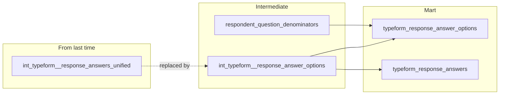

# How to Count a Person Exactly Once

*It's still just one Naruto.*

Last week on Obi The Explorer, I covered a data pipeline built on Fivetran that turns every Typeform survey into a single reusable set of models, rather than a fresh CSV and a fresh script every time. You can read all about it [here](https://plurobi.com/blog/2026/09/01/why-we-stopped-rebuilding-survey-analysis-from-scratch-every-time/). Everything was rosy until a survey came through and exposed weaknesses in the modelling. This post explains why counting people isn't the same as counting answers, what had to change in the models to fix it, and how getting it right ended up mattering well outside the warehouse.

<!-- more -->

## The stakes were different this time

So we've managed to abolish the need to download CSVs for every survey and rebuild the same analysis from scratch. Everything works properly until a real survey exposes gaps you didn't address. This time it was a big one: canvassing just over 5,500 people about a pill-based version of GLP-1 treatment, with plans to publish the results.

## Looks can be deceiving

Some questions in the survey let people choose more than one answer, and it broke. Honestly, it's my fault for failing to consider that possibility. I'll frame a common situation. Picture three people answering one question. Sam picks one option. Priya picks two. Jordan picks two more.

| Respondent | Options picked |
|---|---|
| Sam | A |
| Priya | B, C |
| Jordan | A, C |

Clearly, only three people answered the question, but if you add up how many times each option was picked, it looks like five people answered instead of three. Do that across a whole survey, and every percentage comes out too low. This is a perfect example of the kind of failure I hate, a quiet one.

It's the Shadow Clone Jutsu problem. A ninja throws a hand sign, and suddenly there are a dozen of him surrounding you. If you're trying to count how many people you're up against, you'll get it wrong, because it's still just one Naruto. That's exactly what was happening to Priya, for example, every time she picked two options. The pipeline didn't see "Priya, twice", but two different people.

Unfortunately, that's what was happening in the pipeline built in part 1, and it wouldn't have been caught by looking at the dashboard, because it looked legit. Luckily, the stakeholder in this situation caught it by eyeballing the figures. Yay for team effort!

## The structural fixes for the win

Two things needed to change before the figures could be corrected.

A respondent's answer couldn't be treated as a blob of text. Every selected option needs its own row. Sam gets one row. Priya gets two. Jordan gets two. This way, it's possible to count how many people picked option A specifically, instead of unpacking a comma-separated string to find it.

Count people completely separately from counting picks. However many options someone chose, they only ever count once toward "how many people answered this question." That number, real respondents counted once each, becomes the denominator for every percentage that follows.

Here's how this shapes out:

Even though the one-row-per-selected-option model replaced the one-row-per-question model, the latter did not disappear. It was just repurposed for a different view. As seen in the mermaid diagram, typeform_response_answer_options powers the cross-tab mart, while typeform_response_answers rebuilds the same one-row-per-question shape downstream. typeform_response_answers helps answer the question "what did this person answer?" Nothing really got lost, just moved. The denominator count follows the same rule; it only feeds the cross-tab mart and was never meant to touch the other model.

## Why it matters

Because this got caught and fixed before the numbers went anywhere, the demographic breakdowns behind that survey held up. Age groups and patient segments percentages were accurate.

That survey became Promise of the Pill, published as a public report in which 2,000 UK adults and 3,488 current patients were asked what they actually think about swapping an injection for a tablet.

One key insight was that 61% of people not currently on GLP-1s said they'd prefer a daily pill over a weekly injection. This number dropped hard, down to 27%, the moment people were told what daily dosing would actually involve. Elsewhere in the same report, 41% of existing patients said a pill format could ease some of the judgment they feel about being on treatment at all.

Numbers like that only mean something if the count underneath them is honest. If the multi-select bug had made it through instead, some of those percentages would have been quietly wrong in something meant to be read and trusted by people who'd never heard of a dbt model in their life. So, again, yay for team effort.

## What "self-serve" actually means

The experience made me realise that self-serve analytics isn't just about a fast-loading dashboard. Rather, it's about ensuring accuracy in any reporting that influences people's decisions. The loop's finally broken. No downloading CSVs and doing repetitive analyses anymore!
