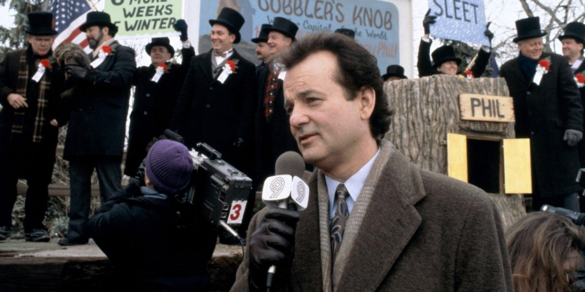
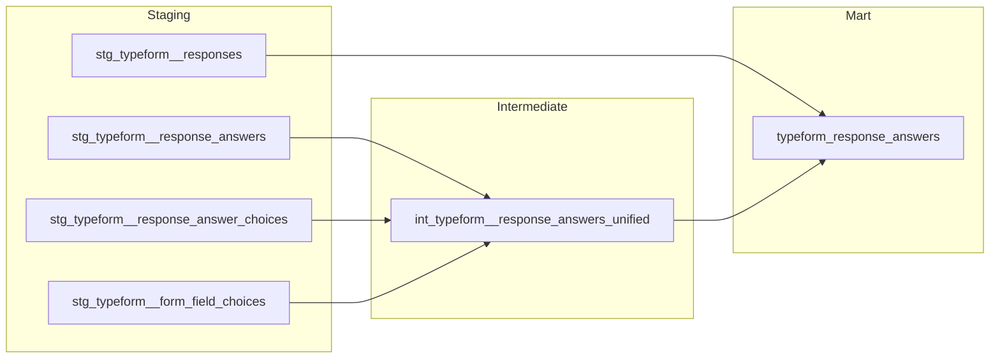

# Why We Stopped Rebuilding Survey Analysis From Scratch Every Time



*Our own Groundhog Day.*

At my current company, we run patient feedback surveys, clinical intake forms, and stigma studies through Typeform. Think teams across multiple markets and functions. The same way any company interested in providing its customers with the best possible experience would. For the uninitiated, Typeform is a form builder that lets businesses collect data people want to share. It's easy to use, customisable, and it's great. (Not a sponsorship wink wink).

<!-- more -->

The hard and frankly more tedious bit was analysing the results every time. As the Junior on the team, this was part of the responsibilities early on when I joined. The process was monotonous. It went something like

- Download the CSV from Typeform.
- Clean it up.
- If the survey required patient context, manually join it to the patient data.
- Run the exploratory analysis.
- Share results through a report, a dashboard, or an Excel with a bunch of crosstabs.

Doing work like this is a great way to get your feet under you in a new team and give you points early on by proving you can handle it. So, for that, I am grateful to my manager.

However, ten surveys meant doing that ten times. And for a company very interested in understanding its customers, that quickly piles up. Nothing got easier or faster. It was just the same. Strangely, I felt like Phil (Bill Murray) from Groundhog Day or Cage (Tom Cruise) from Edge of Tomorrow. Pat on my back for this one. If you haven't watched either, please do!

The second thing I'm grateful for was the proposal to build a generalised model in the warehouse. An idea that hadn't occurred to me. Again, I had Junior brain and was inexperienced.

## One model, not one per survey

The fix was to skip the script I had altogether, not to make it smarter. Building a generic dbt layer that sits right on top of Fivetran was the way to do this. Again, for the uninitiated, Fivetran is a data platform that lets you move, manage and transform data for analytics. It's secure, easy and quick to set up.

Think about moving data from an application, database, or file storage into a destination. This destination could be a data warehouse, lake, or database. This is called a connection. In this scenario, Typeform is one of the sources you can move data from or simply a connector.

Similarly, they also do reverse ETL. Think about moving data from your warehouse, lake or database to a destination. That destination could be a CRM like Attio or a marketing platform like Braze. This is called an activation. Again, not an endorsement. If you've never heard of them, you're not alone. I too was clueless. But we learn every day.

So, one set of models for any survey, past or future, with no rebuilding. The data lands in Snowflake once, using our usual three-layer setup, which includes staging, intermediate, and mart. Then let Looker handle the rest. Stay tuned for another article about these tools. On paper, that's a normal dbt project. In practice, Typeform's schema had other plans.

## One question, two tables?

So, Typeform doesn't store an answer in one place. It splits them by type. That could be text, a number, or a date. These live in one table called `RESPONSE_ANSWER`. Multiple-choice picks lives elsewhere entirely: `RESPONSE_ANSWER_CHOICE`, one row per selected option. Querying just one of those tables gets you half the survey. To get a clean answer, you need to look at one row per response, per question. To get this, both tables needed to be unified into a single model, as shown below.



That one model, `int_typeform__response_answers_unified`, became the piece the rest of the pipeline leaned on. Once it existed, nobody downstream had to think again about which raw table an answer came from.

## The not-so-obvious part

We needed to link survey responses back to patients. This enriches the quality of the data you are working with. Typeform calls these hidden fields. Values like a patient ID are passed in through the survey link itself. The Typeform Entity-Relationship Diagram (ERD) shows a dedicated table for hidden fields, which makes it seem as though the values reside there as well.

Well, they don't. Fivetran flattens every hidden field value straight onto the `RESPONSE` table, as its own column. An ERD is a flowchart that shows how data objects relate to each other within a system or database. Think family tree here. The table the ERD points to only lists which hidden fields a form has, not what a person actually typed.

This was caught by looking at what the live schema contained rather than trusting the diagram. It was a stale diagram/documentation. If the live check hadn't been performed, every patient ID in the model would have returned empty. No error, no warning. Just silence, and a broken join nobody would notice until someone asked why the numbers didn't add up.

It was at this moment that trust in the Typeform diagrams faded. Instead, the live schema was also checked to verify. Trust but verify is key. This is how the next two problems were caught.

## Old rows don't disappear, or at least they shouldn't

Form titles change. Questions get reworded. Choice labels get tidied up.

Typeform's tables handle this by retaining every version of a row, not just the latest. Edit a question, and Fivetran adds a new row rather than overwriting the old one. Query these tables without filtering, and you're pulling stale, duplicate versions of the same question. Sometimes several of them, but every time annoying.

The fix was one line in every staging model that touches these tables. This involved filtering down to the active row only, which is simple, once you know it's needed. Invisible if you don't. Another issue was that Typeform reuses certain field IDs, which isn't a safe key in itself. You need to add the form ID alongside it to mean anything at all.

## The join that decided what counted as data

The model used an INNER JOIN on three tables. Here's what each one connects:

- One joins every response to the form it came from, so you know which survey it belongs to.
- Two others join a selected choice stored as just an ID, like a code for the actual label a person read, such as "Yes" or "Prefer not to say."

Using the INNER JOIN was wrong here because the moment a form got archived, or a choice option got deleted, the INNER JOIN dropped every response tied to it. There was no error or warning. The row just disappeared, and every count built on top of it was quietly wrong.

```sql
-- an inner join here drops any answer whose choice
-- option was later edited or deleted from the form
left join stg_typeform__form_field_choices ffch
    on rac.choice_id = ffch.choice_id
    and rac.field_id = ffch.field_id

-- keep the answer even when the label is gone —
-- fall back to the raw ID instead of losing the row
coalesce(ffch.label, rac.choice_id) as answer_text
```

Switching to a LEFT JOIN and adding a fallback for the missing label fixed all three. An archived form's response is still a response, and a deleted choice's answer is still an answer.

The lesson here is that wherever a dimension can be edited or deleted after the fact, using an INNER JOIN quietly drops real data silently, leading to unreliable and inaccurate numbers.

## What's different now

Since building this layer, anyone running a Typeform survey that needs patient context no longer has to wait on a CSV-and-script cycle. The models exist once. Looker sits on top of them for visualisation through dashboards and reports.

The time that used to go into downloading, cleaning, and joining data by hand now goes into actually answering the question someone asked. This saves the analyst time and allows them to work on other tasks. This allows the stakeholder to gain insights faster and gives them the freedom to explore them as they see fit, eliminating tedious back-and-forth.

## What's next?

This design puts every question on one clean row per response, right up until a question lets someone pick more than one answer. Multi-select breaks that way, which is hard to notice until you try to count how many people picked a specific option. That's a different problem entirely. Stay tuned for next Monday, when we get to day two of the loop.
