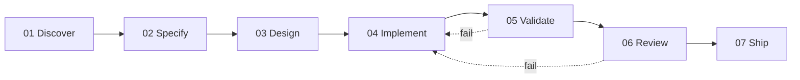

# The Seven Gates We Put Between an AI Agent and Our dbt Models

How our data team stopped trusting a coding agent to remember the process.

**TL;DR: An AI agent will write you a dbt model that compiles, passes every test, and is wrong. Adding more instructions doesn't fix this, because the real gap is memory, not knowledge. We moved the process out of the agent's head and into the repo: seven phases, each a gate that must be verifiably passed before the next can start. Below is the whole workflow, what triggered it, and what it's caught so far.**

<!-- more -->

> The agent said the historic data was there. It wasn't. Nobody checked, the tests were green, and it went to review.

You pick up a ticket, open your coding agent, point it at the repo, paste the ticket's content and tell it to build the model. It writes the SQL, the dbt build goes green, and you open the PR smiling. Sound familiar?

That was our process, too. It's fast; you get a lot of work done, but it has no safeguards. Literally none.

You implicitly trust the agent to remember to check its assumptions, remember to search for an existing macro, and look at the data produced rather than just whether the SQL compiled. But it doesn't reliably remember any of that, I mean, who really does? especially in long sessions, and especially after the context window gets compacted.

So, we stopped asking it to.

## 1. The problem is confident, invisible wrongness

In DBT, the failure mode that hurts you is the one that silently delivers incorrect data.

In some weird way, you're glad a model breaks because it reveals edge cases that weren't accounted for or new data inconsistencies. You know there's something wrong, and you have a clear idea where to begin to fix it. The reverse is quite dangerous. Its output is the one that compiles, passes its tests, and quietly returns the wrong numbers into a dashboard that someone makes decisions from.

**What this looked like for us in one instance.** One ticket produced four separate failures in a single piece of work:

* The agent assumed that a source table already covered the historical range that the model needed; there was no query, just a claim.
* It wrote around 150 lines of SQL to union sources, when a standard macro for exactly that already existed in the project.
* It read directly from the source in three separate models, breaking our staging-layer contract.
* It reviewed its own work in line rather than handing it to a reviewer.

**Why this matters more than it looks:** none of these is a rare failure. It screams great power, no responsibility, no forced fact-check, no forced macro search, no independent review, and no record of what was checked and what wasn't. Just vibes.

And all four passed. The SQL compiled. The tests were green. The PR looked fine.

In this case, testing catches the wrong category of problem. Your null and uniqueness tests verify that the code behaves as expected. They say nothing about whether the assumption underneath the code was ever true.

## 2. Make the process a property of the environment, not the agent

Adding more instructions to the prompt doesn't work because the agent is failing to remember the rules under load.

Instead of trusting the agent to remember the process, the repo enforces it independently of what the agent remembers.

Work moves through seven phases. Each transition is a **gate**, not a suggestion. Nothing proceeds until the current gate passes, and a gate passes only when every item on its checklist is verified: the artefact exists, the correct step actually ran, and the state file was updated.

**That last point is worth pausing on.** Discovery, test-writing, output validation and peer review each run in their own sub-agent, with their own context window, and hand back a short report rather than dumping their work into the main thread. It's why the agent doesn't lose the plot on a long ticket: the main conversation never has to hold it all at once.

**One rule does most of the work here:** a passing comment doesn't satisfy a gate. If someone says "looks fine, keep going" in the middle of a conversation, that isn't approval for a step that never ran. That single line kills the most common way these workflows quietly degrade.

## 3. The seven phases

Each phase exists because skipping it produced a specific, named failure.

* **Discover & fact-check:** mandatory and blocking. Verify or disprove every assumption, and map what sits downstream. No solutions proposed until this passes. This shows that "the historic data is there."
* **Specify:** write down what "done" means. Numbered requirements, each with a matching validation criterion, are posted back to the ticket and documented in the repo. The spec lives where the work lives, rather than dying in a chat transcript.
* **Design:** the technical approach, plus what this change does to lineage.
* **Implement:** write the code according to the team's rules, and write the tests alongside it.
* **Validate output:** check the data, not the code.
* **Review:** a structured review pass. Issues are logged by severity, and anything deliberately skipped is written down rather than quietly dropped.
* **Ship:** Open the PR. A GitHub workflow posts it to our team channel, with the details filled in from the template, so the work is visible without anyone having to look for it. A human merges. Nothing auto-merges in any mode.

Not everything gets the full seven. Bug fixes and refactors take shorter routes, and a standalone request like "review my PR" jumps straight to the relevant phase. Applying full ceremony to a one-line change is how a process gets abandoned in month two. Plus, you have to keep that token bill down!

The specs pile up, and that matters. Eleven weeks in, the specs folder has quietly become the thing we search when someone asks, "Has anyone touched this model before, and why?" We didn't set out to build a decision record. We got one for free.

## 4. Validate the data, not the code

"The tests passed" is a claim about your SQL. It is not a claim about your numbers.

This is the phase most AI coding workflows don't have at all, and it's the one I'd add first if you only added one.

Validation is its own gate, and it compares the actual output, row counts, grain, and a diff against a production baseline, to what the spec said should happen. Not "did it run." Did it produce what we said it would?

Then each criterion gets tagged, and the tag decides who signs off:

* **Objective:** checkable against ground truth. "Row counts match production." A machine can confirm this.
* **Subjective:** requires a person to look at it and judge it. "Is this model structured the way we'd want to maintain it?"

Objective criteria get checked automatically. Subjective ones stop and wait for a human, every time, including in scheduled runs.

That's a deliberate refusal to automate. Most tooling in this space is sold on removing the human. We drew the line at judgment, on purpose, and the system enforces it rather than leaving it to whoever's reviewing that day.

## 5. What it's actually produced

70+ spec runs in about 11 weeks. Real directories with real state files. Most of our recently merged work now has a spec behind it.

I don't have a time-saved number. What's accumulating instead is something better: decision context. The rules, conventions, and preferences that used to live only in people's heads are now written down so the next person, or the next agent, can actually find them.

Here's what I can show you instead. On one routine bug fix, discovery and review surfaced four pre-existing defects that had nothing to do with the ticket:

* A join on a single key that silently duplicates rows. The same defect that a previous ticket had already fixed elsewhere quietly reappeared in a sibling model.
* A model building green, passing every test, and emitting zero rows. Healthy by every automated check. Completely dead.
* Floating-point drift in a price column, because monetary values were typed as FLOAT instead of a fixed-precision decimal.
* The same business logic is copied and pasted across three models instead of being owned by a single team.

None were fixed in that PR; they were logged as follow-up tickets rather than allowed to creep the scope. But none would have been found either. A workflow that stops at "the tests are green" ships all four.

## Where I sit with this

I haven't yet shipped a ticket through this workflow end to end. However, what I'm working on to improve it is the enforcement machinery beneath it. Specifically, the hooks that keep the gates from falling when the agent's memory doesn't.

That'll be discussed over the next few posts. This focuses on the system map. Subsequent posts will dive into how the gates are enforced when the context window resets, why the work is split across specialised sub-agents rather than a single generalist, and how the agent is wired to Jira, among other aspects.

## If you're running dbt with an agent

The plugin is open source under the MIT license: [github.com/Simple-Online-Healthcare/dbt-spec-driven-plugin](https://github.com/Simple-Online-Healthcare/dbt-spec-driven-plugin). It's built for Snowflake Cortex and portable to other agent tools.

If you're letting an AI agent write models in a repo that other people depend on, I'd like to know which of these failure modes you've hit and whether you found them before or after they reached a dashboard.

--8<-- "cta-book-call.md"
