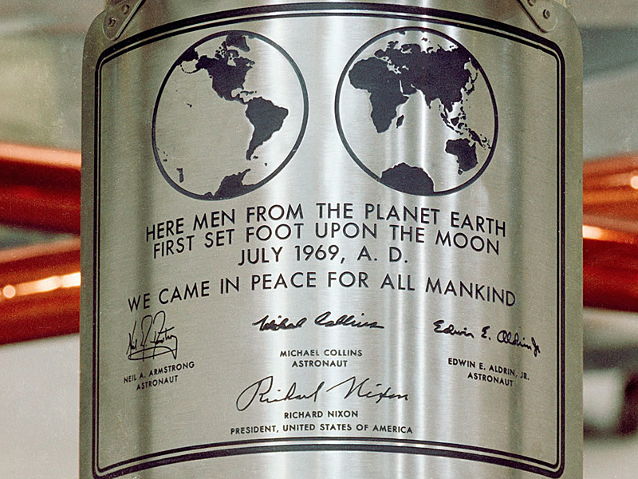
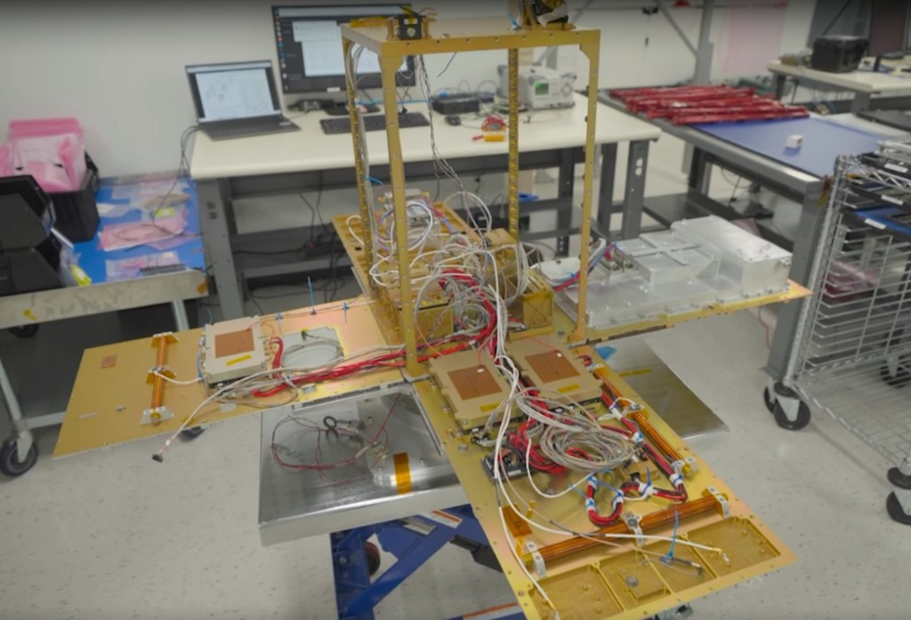
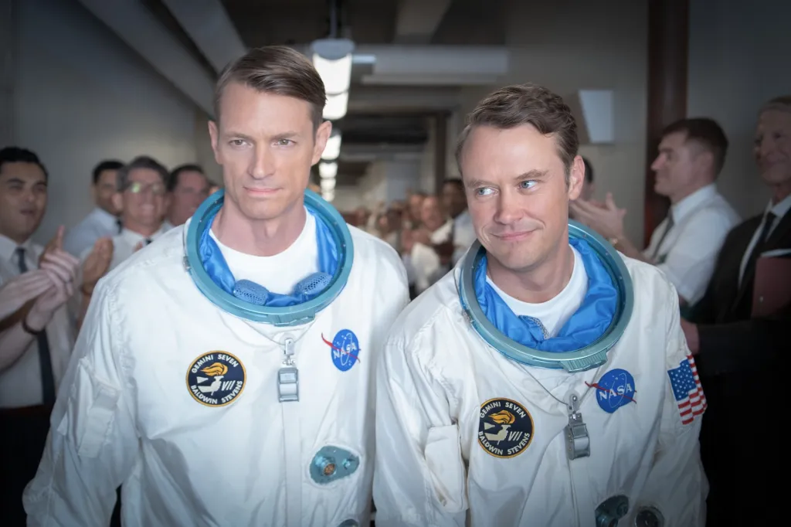

# Still, For All Mankind

Over the last year, demand for intelligence has skyrocketed. Agentic AI is more popular than ever. However, the popularity of the infrastructure necessary for its acceleration is declining rapidly. Everybody hates datacenters. New York moved to block the construction of new hyperscale data centres, but Starcloud is here to save the day. Or is it?

<!-- more -->

Let's set the stage for one of the fastest-growing unicorns in history, shall we? On the second day Starcloud existed as a company, its founders booked a SpaceX rideshare launch even though they didn't know what they were putting on it. This helps clarify the greatness I will briefly examine in this post. Strap in for Launch. Too much?

## Some Consultants Do More Than PowerPoint

Philip Johnston was at McKinsey working with national space agencies, close enough to watch launch costs fall faster than most people were paying attention to. Some consultants do more than work on PowerPoint presentations. Who'd have thought? In early 2023, he visited Starbase on a whim to verify what he was seeing. What he saw was two gigafactories under construction to produce two to three reusable Starships per day. By his math, three reusable Starships a day, every day, for three or four years straight, equals an industry with launch capacity a thousand times that of 2023.

He ran a simple thought experiment: if launch cost dropped 10x and capacity rose 1,000x, what would suddenly make sense that doesn't today? Ask that question to a couple of great engineers like Ezra Feilden and Adi Oltean, his eventual co-founders, and the wheels begin to turn pretty easily. Reminds me of Uni. Sigh. I'm not crying, you are. Anyway, that was the whole recruiting conversation.

The first answer was space-based solar. Picture huge panels in orbit, beaming power they've absorbed down to Earth. As cool as it sounds, you lose 95% of the energy in transmission. That clearly wasn't viable, but it presented another opportunity. In 2023, most new energy projects being built on Earth were already earmarked for data centres, directly or indirectly. So they reran the model for orbital data centres instead, and landed on $500 per kilogram as the launch-cost break-even point where the whole idea stops being science fiction.

## The Dumbest Idea in the Room

Obviously, as you can imagine, getting something like this off the ground was difficult. If it's hard to build datacentres on Earth, how would it be any easier in space? Talk less of all the other factors besides cost. Safe to say, Johnston and his team have faced their fair share of criticisms for their plans. Sam Altman, the OpenAI CEO, thinks orbital data centres are ridiculous, and there's been a video that really critiques the scientific foundation of Starcloud's ideas.

Johnston himself has said that the standard reaction for the better part of two years while he was trying to raise money was:

> "This is the dumbest thing I've ever heard"

Investing in hardtech in space was not the most attractive option. Sadly, this isn't an engineering review blog, so I'm not about to go into all the technical bits. Even after all this backlash and doubt, Starcloud's sole focus has been on its improvement. They've published their [whitepaper](https://www.starcloud.com/whitepaper) and just put in the work to show results. You can track starcloud-1 and watch it deploy [here](https://www.starcloud.com/starcloud-1).

## Ice Baths and Hair Dryers

Starcloud-1 carried the first Nvidia H100 flown in space. Johnston recalls the night before Starcloud-1 had to ship for launch, there wasn't time left to book a proper thermal vacuum chamber to test whether the satellite's cooling material would crack under repeated heating and cooling. So at 5 am, co-founder Ezra and Adi dunked the H100 in an ice bath, dried it out with a hair dryer, and dunked it again, checking each time that the electronics still worked.

The actual fix that made it into orbit was nearly as improvised. They submerged every component in a phase-change cooling material. It's not scalable, and it runs on a low duty cycle while the material melts and resolidifies. But it proved that an H100 could survive in space at all, which nobody had done before. Is this finicky? Yes. But did they end up doing something that has never been done before? Also Yes.

Elsewhere, the ingenuity is just as cool. Instead of expensive space-grade electronics, Starcloud tests off-the-shelf automotive-grade components in radiation chambers over time and picks whichever survives best, the same trick that's helped SpaceX cut satellite costs for years. And because solar panels generate power as DC in the first place, running GPUs natively on DC sidesteps the lossy AC-to-DC conversion that wastes power in data centres everywhere, on Earth or off it.

## Still Not Out of the Woods

There's still a lot of work to do. SpaceX still needs to build out the capacity for the launch cadence that Starcloud depends on. Their success is tied to Elon Musk and other space companies, such as Blue Origin. On the engineering front, roughly half the engineering team is working on one of two unresolved problems: how to shed heat without air to carry it away and how to keep chips working in an environment that steadily corrupts them.

For heat, they're building a large, deployable radiator that's at least 10 times lighter per watt of dissipation and 500 times cheaper per watt than the one on the International Space Station. For radiation, hardware gets shipped to a particle accelerator at Brookhaven National Lab for heavy-ion testing and a cyclotron in Knoxville for high-velocity protons, exposed over 24 hours to the same radiation dose it would take five years in orbit to accumulate, mapping exactly where an H100, B200, and H200 each start to fail.

## Ed Baldwin Would Approve

The first time I watched Starcloud-1 deploy, I couldn't help but think of *For All Mankind*. If you haven't seen it yet, you should. It's an Apple TV show that portrays an alternate history in which the Soviets beat the US to the Moon. The name was inspired by the Apollo 11 plaque that read: "We came in peace for all mankind." Ironically, the rest of the show is what happens when that promise runs headlong into budget fights, a space race, and two governments each trying to out-build the other. Sometimes not peacefully. Sound familiar?

The North Star for NASA in the show was to get to Mars. First the Moon, then Mars. As Ed Baldwin would say, pushing the envelope is something we should all strive for. While it's important not to dismiss criticisms, I'd rather critics try to help make the impossible possible than offer an outright dismissal. I'm rooting for Starcloud. I'm partial to people who put the time in instead of talking and justifying how much time they've put in. Results do all the talking. Who knows what brave frontiers will open up once they (hopefully) figure this out more. Again, we have reusable rockets now!

--8<-- "cta-book-call.md"
