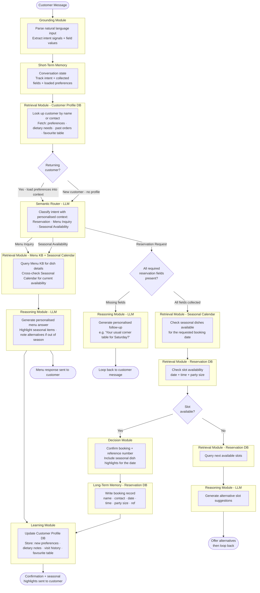

# The One Where The Agent Learns

Last time on Obi the Explorer, I gave the restaurant chatbot [a second job](https://plurobi.com/blog/2026/09/14/the-pause-where-i-go-and-ask-the-kitchen/). It could take a booking, and now it could answer questions about the menu. A Semantic Router sat near the front and chose which path a message took.

<!-- more -->

I left that post with a question I couldn't answer. Is it better to be usefully anonymous than badly personal? Every conversation started from nothing, and I wasn't sure that was a problem worth fixing.

This week, we're going to fix it.

But first, I have to introduce you to "The regular". It's a concept that's very familiar. I'll explain using one of the most popular coffee shops on TV—Central Perk. In Friends, the gang hangs out there every day. There's no specific reason per se. It could be an emotional connection, a habit, or support for Rachel. But look at what the place gives back. The couch is somehow always free, however busy it gets, and Gunther knows every one of them by name. They've stopped being customers. They're known.

The same became clear while I was working in hospitality. There was always the couple that came in every Friday for a few pints and a round of bowling, or a group that came go-karting before heading out that night. It became natural to know what they like and suggest offerings based on those preferences to improve their experience. To do that, I had to learn.

## The new requirement

Two things this time. First, the chatbot should inform customers about the availability of seasonal dishes. The menu isn't fixed because things come and go with the season, and there's no point recommending something that's out of season.

Second, it should remember returning customers. Their preferences, their past orders, the things that make the experience feel as if it were built for them rather than issued to them. The first one is a new data source. The second one is a different thing entirely, and it took me a while to see why. Bear with me, I'm learning this too.

## What it replaces

For seasonal availability:

1. The chef builds a seasonal calendar for the month or quarter
2. Staff get briefed on what's available that day
3. When a customer asks, staff check the calendar or shout through to the kitchen
4. Staff suggest alternatives for anything out of season

For customer preferences:

1. The floor keeps a notes system — a book, a CRM, or the collective memory of whoever's on that night
2. Regulars' preferences get recorded: favourite table, wine, dietary restrictions
3. When a returning customer calls, someone checks the notes
4. Service gets personalised from there

Same exercise as always. The seasonal calendar is another **retrieval** source, no different in kind from the menu. But look at step 2 of the second list.

Recording a preference isn't retrieval because nothing is being fetched. Rather, something is being **written**, and it's about a person, not a booking.

## The thing that actually changed

In iterations 1 and 2, the agent only ever read. It pulled availability from a database and dish descriptions from a knowledge base, and the only thing it ever wrote was the booking itself, which is really just a record of the transaction it was asked to perform.

Iteration 3 is the first time the agent learns something it wasn't asked to store. Introducing the **Learning module**, everyone. It's the component that was missing in the previous posts because nothing needed it yet. It updates memory, prompts and embeddings based on what happened. In this system, it does one job: after a conversation resolves, work out what's worth keeping about this person and write it to their profile.

## What changed from iteration 2

| Component | Change |
|---|---|
| Retrieval — Customer Profile DB | New: look up the customer, load their preferences |
| Retrieval — Seasonal Calendar | New: check what's available for a given date |
| Learning module | New: write updated preferences back after every interaction |
| Long-term memory | Now two stores: Reservation DB and Customer Profile DB |
| Reasoning (LLM) | Upgraded: generates personalised responses using loaded preferences |
| Semantic Router | Upgraded: now handles a third intent, seasonal availability |
| Everything else | Carried over untouched |

Three new components have been added.

## Three decisions worth arguing about

### Why does the customer lookup sit before the router?

You may recognise this argument. Last week, I put the router after short-term memory, because "does it have nuts?" is meaningless without knowing what "it" refers to. This is the same rule, but one level up. Knowing who is talking changes how everything downstream should behave, so the profile must be loaded before anything can make a decision.

Take a returning customer who opens with "same as last time?" The router can't classify that. It isn't a booking request, a menu question or a seasonal query until you know what last time was. Load the profile first, and it becomes obvious. Load it after the router, and you might as well be guessing.

**Anything that changes how a decision should be made has to be loaded before that decision is made.** I suspect I'll be writing some version of that sentence in every remaining post.

### Why does the Learning module sit at the end of every path?

This one took me a couple of attempts to get right. My instinct was to put it wherever the interesting information appeared. For instance, if a customer mentions they're a vegetarian, write that down immediately.

The problem is that you don't know what's worth keeping until the conversation resolves.

Someone might say they're vegetarian and then clarify that it's their guest, not them. They might ask about the corner table and end up booking the terrace. Mid-conversation, everything is provisional. One thing that was also clear from my experience is that people change their minds all the time during conversations.

At resolution, you know what actually happened. So Learning goes last, on every path, including the menu path. A customer who asks about gluten-free options twice in three weeks has told you something, even though they never made a booking either time.

### Why "write the booking" and "learn the preference" are different components

Both of them write to a database at the end of the flow. It would be easy to collapse them into one node. But they're doing different jobs. The Reservation DB records what happened, which is a fact given directly and should be stored accurately. The Learning module decides what it means. An interpretation, derived from the conversation, that nobody explicitly handed over.

One is **transcription**, while the other is **inference**. They have different failure modes. A bad booking record is an operational error someone will phone about, while a bad inferred preference makes the service worse, and nobody tells you. Unless they really like the offering and want a better experience.

Hence, they should be stored separately. At least, that's how I have chosen to design this: a different structure, a different update frequency, and different consequences when they're wrong. Merge them, and every change to how you handle preferences puts the booking record at risk.

## The capability so far

Looking back across three iterations, each one added a different kind of capability rather than just another feature:

- **Iteration 1:** The agent executes a task
- **Iteration 2:** The agent routes between tasks
- **Iteration 3:** The agent remembers across tasks

That third one is the first that persists beyond a single conversation. It's also the first that can be wrong in a way the customer notices and the system doesn't: so high risk, high reward.

## What's still missing

The agent now reads from four sources, writes to two, and can maintain a coherent relationship with someone over months.

But everything it does still stays inside its own world. It queries and writes to its own databases. It has never once reached out and made something happen somewhere else.

Which brings me back to the question I left hanging last week: whether badly done personalisation beats none at all. I think I've moved slightly. The risk isn't really that the system gets your preferences wrong; it's that it stores things about you that you never handed over. My favourite table is a preference. My dietary restriction is closer to a medical fact. The architecture treats them identically because, to the Learning module, they're both just fields on a profile.

If you've seen Ex Machina (you really should have), you'll know where this goes wrong. Spoilers ahead. Ava doesn't win by being clever. It wins because it learns so much about you that it knows you better than you know yourself. So that's an answer to my question from last week, just not the one I expected. Ava isn't badly personal. It's perfectly personal, and that's what makes it dangerous. A restaurant remembering that you like the window seat is nowhere near that. But the mechanism is the same shape: watch what someone does, decide what it means, and act on it without asking.

I don't think there's a clean technical answer to that. It's a decision about what you're willing to infer, and the diagram won't make it for you.

Next time, the agent stops reading and starts taking pre-orders and managing inventory, and tells a chef to start cooking.

If you're building agents and trying to figure it out, I'd genuinely like to hear about it.

--8<-- "cta-book-call.md"
