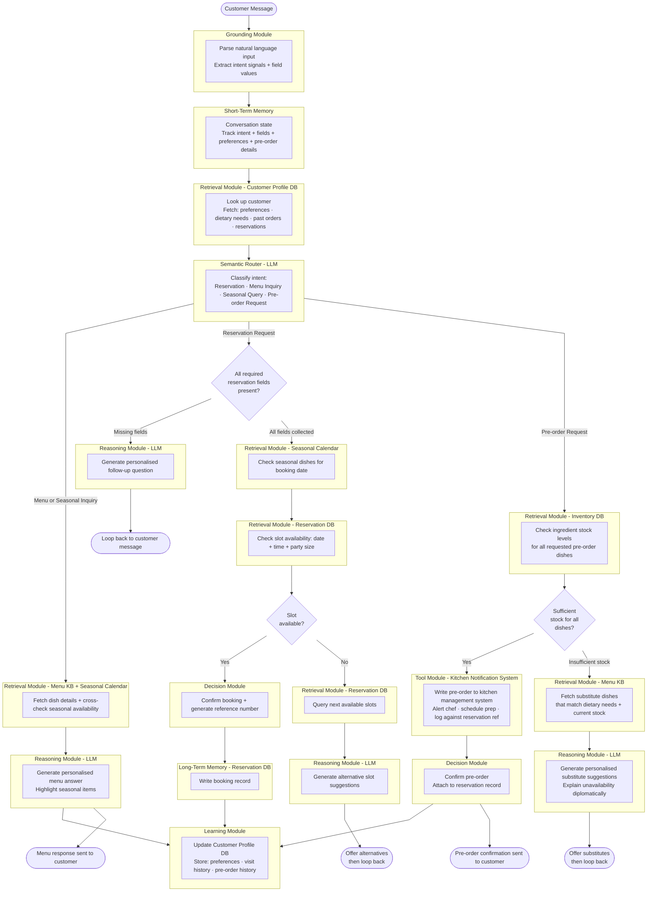

# The One Where We Make Contact


Last time on Obi the Explorer, [the agent learned](https://plurobi.com/blog/2026/09/21/the-one-where-the-agent-learns/). It remembered regulars, kept track of what they liked, and wrote it all down once each conversation was over. I closed on Ava from Ex Machina, and the idea that the dangerous part isn't knowing someone. It's acting on it without asking.

This week, the agent finally acts. Not on you, thankfully. On the kitchen.

If you've watched The Bear, you'll know the sound. An order gets called, and the whole line shouts "yes, chef!" before anyone has touched a pan. Once an order is fired, it's happening. Ingredients come out, prep starts, and someone's evening now revolves around that dish. You can't really un-fire it.

That's the moment this post is about.

<!-- more -->

It was the same at work. Party bookings sometimes came with food ordered in advance. I'd take it down on the call, then walk it over to the kitchen so they could plan. Now and then, the kitchen came back short on something, and I'd be back on the phone apologising and offering an alternative.

## The new requirement

Customers should be able to pre-order dishes for a future reservation. Before anything is confirmed, the system checks the inventory to ensure every ingredient will be available. The kitchen gets to plan, and customers aren't left disappointed.

## What it replaces

For pre-orders:

1. The host notes the pre-order in the reservation book
2. The host tells the chef or kitchen manager manually
3. The kitchen checks the current inventory for the ingredients
4. For speciality items, the chef orders ingredients specifically for that booking
5. If something can't be sourced, the host calls the customer back with alternatives
6. The kitchen keeps a separate calendar of special orders

For inventory:

1. Kitchen staff count stock daily
2. The chef projects what's needed based on reservations and history
3. Orders go out to suppliers
4. Last-minute adjustments happen when something runs short

Same exercise as always. Step 3 is **retrieval**. Step 5 is **reasoning**, working out a decent alternative and phrasing it nicely. But look at step 2 of the first list.

Nothing is being fetched or remembered. The host is telling another team to go and do something. Which, if you've worked in hospitality, can be very annoying. Hopefully, you have a great manager.

## The thing that actually changed

Up to now, the agent has only worked inside its own world. It read from and wrote to its own databases. Even the Learning module from last week only wrote to a profile that the agent owns.

Iteration 4 is the first time the agent reaches outside and makes something happen in a system it doesn't own. We're finally ready to make contact with the outside world! The kitchen doesn't hand back data for reasoning. It receives an instruction, and then real people start doing real work.

Obviously, this is where I insert what movie or show my study reminded me of. Today, that's Arrival, one of the best alien invasion movies I've ever seen. Except, it's more of a language lesson. The heptapods turn up, and the whole film is about two completely different worlds trying to make contact without getting each other catastrophically wrong.

That's this iteration. For three weeks, the agent has stayed inside its own walls. Now it has to reach out to a world it doesn't control, one with its own rules and its own way of doing things. Get the message wrong, and something real happens on the other side.

I hate spoilers, so I'm not going to subject you to any. (Yes, I know. Ex Machina. Last week. I've grown since then.) What's important is that you should watch this!!!!!

Back to being serious...

Introducing **Tool Integration**, everyone. For the uninitiated, a tool is anything that lets the agent do something in the outside world, rather than just read or generate text. Calling an API, sending a notification, writing to someone else's system. In this case, telling the chef to start prepping.

## What changed from iteration 3

| Component | Change |
|---|---|
| Semantic Router | Upgraded: now handles a fourth intent, pre-order requests |
| Retrieval — Inventory DB | New: check the ingredients are in stock |
| Decision — can we fulfil it? | New: enough stock or not |
| Tool — Kitchen Notification | New: send the pre-order to the kitchen and alert the chef |
| Reasoning — substitutes | New: suggest alternatives when stock is short |
| Learning module | Upgraded: now also stores pre-order history |
| Everything else | Carried over untouched |

Four new components, and one of them is the first box in this series that can't be undone.

## The pre-order path

```
Router → Pre-order path
  → Check the Inventory DB
  → Enough stock for every dish?
      → Yes → Notify the kitchen → Confirm the pre-order → Learning
      → No  → Find substitutes in the Menu KB
             → Suggest them to the customer
             → Loop back
```



## Three decisions worth arguing about

### Why is the kitchen notification a Tool and not Retrieval?

Both of them talk to another system, so it would be easy to call them both "integrations" and move on.

I nearly did, but they're different. Retrieval is read-only. It pulls information into the agent's context, and if it fails, you try again, and nothing in the external world has changed. A tool produces a material change. If it fails halfway through, you might not know whether the chef got the message. Retry mindlessly, and the kitchen might prep the same order twice.

Different failure modes, retry rules, and things to watch for. Calling them by the same name hides all of that. Moreover, not acknowledging the difference is how you end up with two birthday cakes and a very confused customer. Yes, I've caused my fair share of confusion. We all learn from mistakes.

### Why check inventory before notifying the kitchen?

This one seems obvious once it's written down, but it's probably the rule I'll lean on most for the rest of the series. **Never take an irreversible action before all preconditions have been checked.**

Reads are cheap. You can check the inventory ten times, and nothing happens. In this scenario, telling the kitchen is not cheap. You can end up with the wrong order or quantity, wasting everyone's time. Once the chef has been told, the order has been fired, and we're back to "yes, chef."

So the agent checks stock first, and it only touches the kitchen once all dishes on the pre-order have cleared. Think of it as checking the fridge before asking someone to start cooking. You'd think that goes without saying, but I can't tell you how many times I've been psyched to cook something, only to find out I don't have the ingredients.

### Why do substitutes go back to the customer instead of being swapped in?

When the stock runs short, the agent could pick the closest dish and carry on. It has the menu and the customer's dietary needs from last week, and it could make a decent choice.

It doesn't. It suggests substitutes and hands the decision back.

You may recognise where this comes from. Last week ended with the problem of acting on someone without asking. This is where that line gets drawn in the architecture. The agent is allowed to tell the kitchen what to do because the kitchen belongs to the restaurant, which has approved it. It isn't allowed to decide what the customer eats.

At least, that's how I have chosen to design this.

## The capability so far

Four iterations in, and each one has added a different kind of capability:

- **Iteration 1:** The agent executes a task
- **Iteration 2:** The agent routes between tasks
- **Iteration 3:** The agent remembers across tasks
- **Iteration 4:** The agent acts outside itself

That fourth one is the first where a mistake has real repercussions. A bad booking record is annoying, but the wrong instruction to the kitchen costs ingredients, time, and somebody's patience.

It's also the first path where the order of the steps genuinely can't change. Check the stock, then notify the kitchen, then confirm. If you swap any two, the workflow breaks. Keep that in mind, because it comes back once things start running in parallel.

## What's still missing

The agent now reads from five sources, writes to two of its own, and sends instructions to one that isn't internal.

But every answer it gives still comes out in one go. It writes a response and sends it. Nothing checks the work. What happens when it suggests a steak as a substitute to a vegetarian? Or vice versa? Personally, I will shed a tear if a salad is ever suggested to me instead of meat. And what about when it treats an anniversary dinner exactly like a Tuesday lunch?

In a real kitchen, that's what the pass is for. Nothing leaves until someone has looked at the plate. The agent doesn't have a pass yet.

My anniversary is in less than a week. So I'll take this opportunity to shout out to my girl. Love you, babe! (Crisis averted).

Which leaves me with a question I'm still chewing on (get it? I just giggled). If the agent learns to check its own work, who checks the checker?

Next time, it's special occasions, and the agent learns to check its own homework.

If you're building agents and trying to figure it out, I'd genuinely like to hear about it.

--8<-- "cta-book-call.md"
