# The One With The Critic

Last time on Obi the Explorer, [the agent made contact](https://plurobi.com/blog/2026/09/28/the-one-where-we-make-contact/) with the outside world. It started telling the kitchen what to do, and I spent most of the previous post explaining why it should check the fridge first. I closed on a question I couldn't quite answer. If the agent learns to check its own work, who checks the checker?

This week, we find out. Kind of.

So last week, I shouted out my anniversary. It was great. Had a lovely dinner and went to a magician's bar afterwards for drinks. As in, while you're at your table, a magician comes and does a whole bunch of tricks. Like your own private show. Try new things, but know enough about the person you're with to decide which risks to take. Alright, that's all for now.

<!-- more -->

Special occasions were a big part of the job. Birthday parties came through all the time, and the booking was the easy bit. The hard part was everything around it. Is there a cake? Does anyone need to know about it before it comes out? Is it a surprise? The number of attendees? Get one of those wrong, and you could ruin someone's moment.

## The new requirement

The restaurant wants two things. First, the chatbot should make special occasions feel special. Birthdays, anniversaries, business dinners. Second, it should provide properly personalised recommendations based on what each customer actually likes and has previously ordered.

On paper, that sounds like more of what iteration 3 already did, but it's different. It took me a while to work out why.

## What it replaces

For special occasions:

1. The host asks whether the booking is for anything special
2. The details get flagged in the reservation book
3. The host briefs the service team on what's coming up
4. The kitchen prepares something complimentary, like a dessert with a candle
5. Staff add the touches, like decorations or a personalised menu
6. The manager sometimes visits the table to say congratulations

For personalised recommendations:

1. Servers remember regulars or check the notes
2. The chef tells staff which new dishes might suit certain regulars
3. Servers suggest things based on past orders
4. Regulars sometimes get offered something off the menu

Same exercise as always. Checking the notes is **retrieval**. Briefing the service team is a **tool** because the host is telling another team to do something. The manager stopping by to say congratulations? That one stays human. No agent is coming to your table (unlike the magician), at least not in this series. Robots are a different story, though.

But the most important step isn't on either list. Between a server thinking of a recommendation and saying it out loud, there's a split second where they check it in their head. Is this right for them? Is it right for tonight? Nobody writes that check down, and nobody trains you on it. It just happens every single time, unless you're told to recommend the most expensive dish.

That check is what this whole iteration is about.

## The thing that actually changed

Up to now, every answer the agent gave came out in one go. It wrote a response, and the response was sent. This is sufficient for a booking confirmation, as there's little room for error.

A personalised recommendation for an anniversary dinner is different. What if it suggests a steak to a vegetarian? What if it ignores an allergy that's stated in the customer profile? What if it recommends something that's out of season? One pass isn't good enough when the cost of getting it wrong is someone's evening.

Introducing **Reflection**, everyone. For the uninitiated, it's a pattern where the agent reviews its own output before sending it. The version I've used here is called **Actor-Critic**. One LLM, the Actor, writes a draft. A second one, the Critic, checks it against a set of rules. If it fails, it goes back to the Actor for another go. If it passes, it goes out.

Obviously, this is where I insert what movie or show my study reminded me of. Today, that's Ratatouille. A restaurant, a chef who isn't supposed to be cooking, and the most feared food critic in Paris. No spoilers (I'm a better man, but how haven't you seen this by now?), but the whole film builds towards the moment the Critic finally tastes the food. Everything in that kitchen is shaped by the fact that someone is going to judge it.

That's the Critic in this iteration. It isn't there to cook per se. It's there to make sure nothing leaves the kitchen that shouldn't.

Back to being serious...

## What changed from iteration 4

| Component | Change |
|---|---|
| Grounding | Upgraded: now picks up occasion cues, like "it's our anniversary" |
| Retrieval — Customer Profile DB | Upgraded: fetches the full taste profile and order history |
| Special Occasion Detector | New: works out what kind of booking this is |
| Actor (LLM) | New: drafts the experience plan |
| Critic (LLM) | New: checks the draft against the profile, the occasion and the menu |
| Tool — Service Team Coordination | New: tells front of house what to prepare |
| Learning module | Upgraded: now records occasions and which recommendations landed |
| Everything else | Carried over untouched |

Four new components. Two of them are the same LLM wearing different hats.

## Where the loop sits

```
Booking path → Special occasion?
  → Yes → Actor drafts the experience plan
         → Critic checks it against the profile
         → Not good enough? Back to the Actor
         → Approved → Tell the service team
         → Carry on to availability and confirmation
  → No  → Carry on to availability and confirmation
```

The loop makes the confirmation better. It never stops the booking from happening.

```mermaid
%%{init: {"flowchart": {"curve": "linear", "htmlLabels": true, "nodeSpacing": 36, "rankSpacing": 44, "padding": 12, "useMaxWidth": true}}}%%
flowchart TD
    INPUT([Customer Message]) --> GROUND

    subgraph GROUND["Grounding Module"]
        G1["Parse natural language input<br>Extract: intent signals · fields · occasion cues<br>e.g. 'it's our anniversary'"]
    end

    GROUND --> STM

    subgraph STM["Short-Term Memory"]
        M1["Conversation state<br>Track: intent · fields · occasion flag · taste profile"]
    end

    STM --> CUST_RET

    subgraph CUST_RET["Retrieval - Customer Profile DB"]
        CR1["Fetch: preferences · dietary needs · full order history<br>taste profile · past occasions · favourite table"]
    end

    CUST_RET --> ROUTER

    subgraph ROUTER["Semantic Router - LLM"]
        SR1["Classify intent:<br>Reservation · Menu Inquiry · Seasonal · Pre-order · Recommendation Request"]
    end

    ROUTER -->|Menu or Seasonal Inquiry| RET_MENU
    ROUTER -->|Pre-order Request| RET_INV
    ROUTER -->|Reservation Request| FIELD_CHECK
    ROUTER -->|Recommendation Request| REFLECT_ACTOR

    subgraph RET_MENU["Retrieval - Menu KB + Seasonal Calendar"]
        RM1["Fetch dish details + seasonal availability"]
    end

    RET_MENU --> REASON_MENU

    subgraph REASON_MENU["Reasoning - LLM"]
        R_M1["Generate personalised menu answer"]
    end

    REASON_MENU --> LEARN
    REASON_MENU --> MENU_OUT([Menu response sent to customer])

    FIELD_CHECK{All required<br>reservation fields<br>present?}

    FIELD_CHECK -->|Missing fields| REASON_FU

    subgraph REASON_FU["Reasoning - LLM"]
        R_FU["Generate personalised follow-up question"]
    end

    REASON_FU -->|Loop back| INPUT

    FIELD_CHECK -->|All fields collected| OCC_CHECK

    subgraph OCC_CHECK["Special Occasion Detector - LLM"]
        OC1["Sub-classify reservation:<br>Birthday · Anniversary · Business Dinner · Standard"]
    end

    OCC_CHECK -->|Standard booking| RET_SEASON
    OCC_CHECK -->|Special occasion detected| REFLECT_ACTOR

    subgraph REFLECT_ACTOR["Actor - LLM"]
        ACT1["Generate draft experience plan:<br>dish recommendations · table touches<br>complimentary items · personalised menu suggestions"]
    end

    REFLECT_ACTOR --> REFLECT_CRITIC

    subgraph REFLECT_CRITIC["Critic - LLM"]
        CRIT1["Evaluate draft against:<br>taste profile · dietary restrictions<br>occasion type · seasonal availability"]
    end

    REFLECT_CRITIC --> QUAL_CHECK{Meets quality<br>threshold?}

    QUAL_CHECK -->|No - revise| REFLECT_ACTOR
    QUAL_CHECK -->|Yes - approved| SERVICE_TOOL

    subgraph SERVICE_TOOL["Tool - Service Team Coordination"]
        ST1["Notify front-of-house:<br>table decor · complimentary items<br>personalised menu · manager visit flag"]
    end

    SERVICE_TOOL --> RET_SEASON

    subgraph RET_SEASON["Retrieval - Seasonal Calendar"]
        RS1["Check seasonal dishes for booking date"]
    end

    RET_SEASON --> RET_AVAIL

    subgraph RET_AVAIL["Retrieval - Reservation DB"]
        RA1["Check slot availability: date + time + party size"]
    end

    RET_AVAIL --> AVAIL_CHECK{Slot<br>available?}

    AVAIL_CHECK -->|Yes| DEC_BOOK

    subgraph DEC_BOOK["Decision Module"]
        D1["Confirm booking + reference<br>Attach occasion plan if applicable"]
    end

    AVAIL_CHECK -->|No| RET_ALT

    subgraph RET_ALT["Retrieval - Reservation DB"]
        RA2["Query next available slots"]
    end

    RET_ALT --> REASON_ALT

    subgraph REASON_ALT["Reasoning - LLM"]
        R_A1["Generate alternative slot suggestions"]
    end

    REASON_ALT -->|Offer alternatives| INPUT

    DEC_BOOK --> LTM_RES

    subgraph LTM_RES["Long-Term Memory - Reservation DB"]
        LM1["Write booking record + occasion plan ref"]
    end

    LTM_RES --> LEARN

    subgraph RET_INV["Retrieval - Inventory DB"]
        INV1["Check ingredient stock for pre-order dishes"]
    end

    RET_INV --> STOCK_CHECK{Sufficient<br>stock?}

    STOCK_CHECK -->|Yes| KITCHEN_TOOL

    subgraph KITCHEN_TOOL["Tool - Kitchen Notification"]
        KT1["Write pre-order to kitchen system<br>Alert chef · schedule prep"]
    end

    STOCK_CHECK -->|No| RET_ALTS

    subgraph RET_ALTS["Retrieval - Menu KB"]
        RAS1["Fetch substitute dishes matching stock + dietary needs"]
    end

    RET_ALTS --> REASON_SUBS

    subgraph REASON_SUBS["Reasoning - LLM"]
        R_S1["Generate substitute suggestions"]
    end

    REASON_SUBS -->|Offer substitutes| INPUT

    KITCHEN_TOOL --> DEC_PRE

    subgraph DEC_PRE["Decision Module"]
        DP1["Confirm pre-order + attach to reservation"]
    end

    DEC_PRE --> LEARN
    DEC_PRE --> PRE_OUT([Pre-order confirmation sent to customer])

    subgraph LEARN["Learning Module"]
        L1["Update Customer Profile DB:<br>preferences · occasion history<br>recommendation feedback · taste profile refinement"]
    end

    LEARN --> BOOK_OUT([Enriched confirmation sent to customer])

    %% Role colours come from docs/stylesheets/mermaid.css (light + dark).
    class INPUT source
    class GROUND,STM,CUST_RET,ROUTER,RET_MENU,REASON_MENU,REASON_FU,OCC_CHECK,REFLECT_ACTOR,REFLECT_CRITIC,SERVICE_TOOL,RET_SEASON,RET_AVAIL,DEC_BOOK,RET_ALT,REASON_ALT,LEARN,RET_INV,KITCHEN_TOOL,RET_ALTS,REASON_SUBS,DEC_PRE process
    class FIELD_CHECK,QUAL_CHECK,AVAIL_CHECK,STOCK_CHECK control
    class MENU_OUT,LTM_RES,BOOK_OUT,PRE_OUT outcome
```



## Three decisions worth arguing about

### Why a quality threshold and not a fixed number of passes?

My first instinct was to say "check it twice" and move on.

The problem is that not every booking needs the same amount of thought. A regular booking their usual table on a Tuesday might pass the Critic the first time. An anniversary dinner for someone with three dietary restrictions and a very specific taste profile might take three goes. A fixed number either wastes effort on the easy ones or gives up too early on the hard ones.

So the loop runs until the draft meets a threshold. But that only works if the Critic knows exactly what it's checking for. Dietary restrictions respected? Occasion matched? Everything in season? **Without explicit criteria, the loop has no way to finish.** It just keeps going round, or worse, it approves whatever it's given.

### Why is the Special Occasion Detector separate from the router?

You may recognise this argument. Back in iteration 2, the router's job was to determine what kind of request this was, whether it was a booking, a menu question, or a pre-order.

The Occasion Detector does something finer. It runs only within the booking path and determines what kind of experience is needed—birthday, anniversary, business dinner, or just dinner.

It would be easy to throw "anniversary booking" into the router as another intent. But then every new occasion means touching the router, and the router starts doing two jobs. Keeping them apart means adding an occasion like "graduation dinner" next year only touches one box. Coarse first, then granular.

### Why does the service team only hear about it after the plan is approved?

You may recognise this one too. Last week, the agent checked the stock before telling the kitchen anything. It's the same rule but with a different team.

The Actor and Critic can go back and forth as many times as they like. That's all happening inside the agent, so it's cheap. But the moment the front-of-house gets told to put balloons on table six, real people start doing real work. So no human hears a thing until the plan has passed.

**Never fire an irreversible action before all preconditions have been checked.** I said I'd lean on that sentence. Here I am, leaning.

## So, who checks the checker?

This is where I owe you an answer from last week. Here's the honest one: a person, at least at first.

The Critic is only as good as its idea of "good". If its criteria don't align with what a real host would approve, the loop doesn't make things any better. It makes them confidently wrong. It approves the steak for the vegetarian, and now it's been approved twice.

So before you trust a Critic, you check its judgment against people's. Take a pile of drafts, have a human mark them, and see whether the Critic agrees. Where it doesn't, you fix the criteria, not the Actor. The industry calls this **judge alignment**, and from what I've learned so far, it matters more than how clever the Critic is.

At least, that's how I have chosen to design this.

## The capability so far

Five iterations in:

- **Iteration 1:** The agent executes a task
- **Iteration 2:** The agent routes between tasks
- **Iteration 3:** The agent remembers across tasks
- **Iteration 4:** The agent acts outside itself
- **Iteration 5:** The agent checks its own work

That fifth one is the first time the agent questions itself before it speaks. Which, honestly, is more than I manage some days.

## What's still missing

The agent now books, answers, remembers, acts and checks. It's starting to feel like a proper host.

But it only works through one door. Everything so far assumes a customer is typing into a chat box on the website. Real customers text. They message on Instagram and Facebook at 11 pm asking if you're open tomorrow.

It also has no idea what's happening in the restaurant right now. It doesn't know the kitchen is slammed, that there's a 40-minute wait, or that there's a private event taking over half the floor. It'll happily recommend a quiet anniversary dinner on the busiest night of the year.

Which leaves me wondering how much of a good host is really just knowing what's going on in the room. And whether an agent can ever know that from the outside.

Next time is the final iteration. Four channels, live restaurant conditions, and the first time things stop happening one after the other.

If you're building agents and trying to figure it out, I'd genuinely like to hear about it.

--8<-- "cta-book-call.md"
