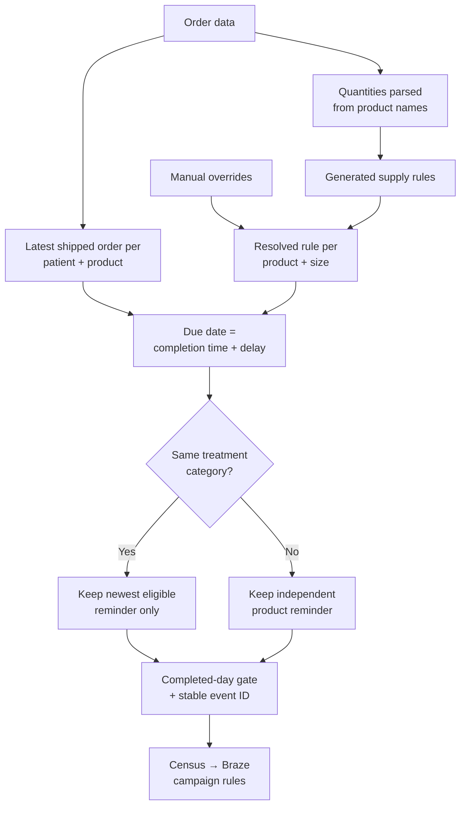
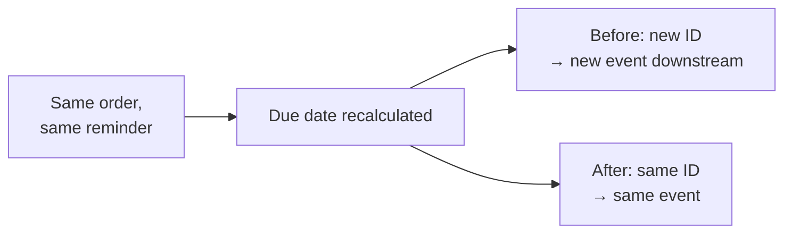

# The One With The Reorder Reminders


In LOST, when the islanders break into "The Hatch," they are alerted every 108 minutes to enter a specific sequence of numbers — 4 8 15 16 23 42 — and press the "Execute" button to prevent the world from ending.

<!-- more -->

Reorder reminders work on the same principle, except instead of the world ending, you risk doing something much worse: disappointing a patient. Every patient is on their own timer; it depends on the product they received, and nothing goes off when we miss it.

## Problem statement

A reorder reminder only helps if it arrives at the right point in a patient's supply — the days of medication they have left — and that point depends on the product. A multi-pen bundle lasts longer than a single pen, and an oral pack follows a different rule again.

Our CRM team runs those reminders in Braze, which needs three things from us:

- Each patient's shipped orders and total shipped orders
- An event when someone becomes a new patient
- A reorder reminder event, timed to the specific product they received

Like all data modelling tasks, failure is usually quiet. If a product has no supply rule, it gets no due date, the row drops out at a date filter, and no error is raised. The table looks healthy, tests pass, and patients who should have been reminded aren't there. A messaging pipeline can be broken and still look completely fine from the warehouse. To me, that's the hardest part of building pipelines.

## Approach overview

The work is split across three layers:

- **dbt models in Snowflake** decide what is true: which events happened, and when a reminder is due for each drug.
- **Census**, a reverse-ETL tool — it moves data out of the warehouse and into other apps, the reverse of how data usually flows in — copies those rows into Braze.
- **Braze campaign rules** decide what to say and to whom.

Snowflake is the pharmacy's order book. Braze is the person making the calls. Get the book wrong, and the call is wrong too, no matter how it's delivered.

My work sits almost entirely in the book, the five stages of it.



*The reminder flow, simplified. Rejection filtering and the separate oral-product path are left out.*

## Step-by-step process

### Step 1: Agree on the events before writing any SQL

The first step isn't technical. The CRM team owns the campaign and knows what they want to say. We own what is true. The work starts by agreeing on which events exist, what each one means, and which timing rule underlies it. So there's a lot of texting back and forth, plus a couple of calls. Underwhelming for most, but it's actually the part I enjoy most — I gain real business context and build relationships along the way.

That conversation produced the event set: a reorder reminder, an order approval, a new-patient event, and four category events marking which treatment someone was starting. The reorder path already existed; I added the rest, including event identifiers, a dedicated supply lookup, extended patient attributes, and the underlying validation.

This matters because an event is an interface. Once a campaign is built on it, another team depends on its name and shape staying the same. Easy to add a new one. Hard to change one that's live.

### Step 2: Turn product names into supply rules

A reminder date starts with how long the product lasts, and the only reliable signal is the product itself. So the pipeline extracts quantities from product names. That sounds trivial until you encounter the real data: bundles, multi-pack formats, quantities written before the product, quantities in brackets, and a few naming conventions that don't match anything else in the catalogue. If you like cleaning data, it's heaven. Otherwise, it's annoying.

Those quantities generate supply rules automatically. Two things keep that safe:

- A manually configured product-and-size entry always wins over a generated one. A supply rule sometimes needs correcting by hand, and that correction has to stick.
- The generator reads raw order items, not downstream order models. Downstream models already depend on supply rules existing, so building the rules from them would mean the rules need themselves to exist first. Reading from raw data breaks that loop — a **circular dependency**.

The math itself is simple: quantity times a configured days-per-unit gives the supply, and the reminder fires a set number of days before that runs out. Oral products take their own path, so pills are never counted as if they were pens, and when a newly launched product has no rules at all, a warning fires. That's the klaxon the hatch had, and we didn't.

### Step 3: Pick the reminder that matters

A patient can have several orders on file, so more than one countdown could be running for them at once. Two decisions make sure the right one wins.

First, match the reminder to the actual product, not a generic size label like "One Size." Matching on the label alone let an accessory inherit a medication's supply schedule — a patient could end up with a reorder reminder for a sharps bin, running on a drug's timeline. Matching on the exact product stopped that.

Second, only one active reminder per treatment. If a patient switches products within the same treatment, the old product shouldn't keep quietly counting down in the background.

That second rule had to go in the right place. The same data that decides reminders also decides approval messages, and applying the rule too broadly would have deleted approvals nobody meant to touch. So it only applies to reminders, never approvals.

One more thing had to be pinned down: what happens when two orders are genuinely tied. The pipeline always breaks ties the same way — by date, then by a fixed order. This way, the same patient gets the same reminder date every time the numbers are recalculated, not a different one depending on when it runs.

### Step 4: Make the event stable and predictable

Event IDs used to include the reminder timestamp. That looks harmless. It isn't.

```text
# Illustrative shape only — not the production SQL
before: event_id = hash(..., event_timestamp)
after:  event_id = hash(patient, event_name, order, product_name)
```

Recalculate a due date, and the hash changes. Census sees an ID it has never seen before and treats the same reminder as a brand-new event.



Taking the timestamp out fixed it. Older reminders were left exactly as they were, so nothing already sent got resent as if it were new.

The lesson is a bit counterintuitive: something can look different every single time you check it, and still not count as the same thing changing over time. Each version looked fine on its own. It was only across versions that the problem showed up, and that's exactly the kind of mistake a routine check won't catch, because it's only ever looking at one version at a time.

Separately, reminders leave the warehouse only when their day is fully over. That means they go out in steady daily batches, not in a trickle as the day fills up.

### Step 5: Get it out of the warehouse, and watch it

If the Braze export runs as part of a single shared job, it inherits every failure in that job, even those unrelated to Braze. A broken test elsewhere in the pipeline shouldn't stop patient messages from going out. So the export now runs on its own, separately from everything else.

A teammate solved a related problem the same way. Before the export runs, a separate step scores discounts. If that scoring fails, the export doesn't wait; it proceeds using the last valid discount data instead of stalling. Different part of the pipeline, same idea: one broken piece shouldn't take the rest down with it.

Running the export on its own also made room for proper monitoring, catching things a pass/fail test can't. Things like a sync that's gone quiet, events that should have arrived but didn't, a sudden drop in daily volume, or numbers that are technically valid but obviously wrong.

None of this guarantees the message actually reaches the patient, though. Getting the export running correctly on its own is only one step. The data still has to sync, still has to be entered into the right campaign, and still has to be delivered — each one a separate point where something could go wrong.

## Results

The results are easier to describe in engineering terms than in business ones:

- **A new product no longer goes unnoticed.** Before, if nobody set up a supply rule for a newly launched product, it just quietly got no reminders, and nothing told anyone that had happened. Now it flags the moment it's missing.
- **Accessories stopped borrowing a medication's countdown.** An accessory used to be able to pick up a drug's reminder schedule by mistake — the sharps-bin problem from earlier. That can't happen anymore.
- **Recalculating a reminder no longer looks like creating a new one.** A reminder's date can change without the reminder itself being new, but downstream, it used to be treated as brand new every time, which meant patients could see the same reminder appear more than once.
- **The same input always produces the same output.** Given the same data, the pipeline now always picks the same reminder and the same date, rather than a slightly different one depending on exactly when it runs.
- **One broken part can't take the rest down.** A failure elsewhere in the pipeline no longer prevents patient messages from going out.

What none of this proves yet is whether it's actually working — whether these reminders bring patients back, or change how much they spend. That's a different kind of measurement, done separately from the pipeline itself, and it hasn't been done yet.

## No Blind Faith

At the risk of sounding cringe (for you alone!), I'll tie it all together using LOST again. Once the islanders got into the hatch, they had a constant reminder to perform a task every 108 minutes, but they never knew why, or how to change anything about it. Our reminders are specific and targeted. The patients know why they receive them. We can add new events dynamically and debug any errors with high confidence. Theirs was a mystery. Ours is transparent, and that's what good engineering gets you.

Patients hear from us when they actually need to, about the thing they actually need, once — not the wrong product, not twice, not never. And the business isn't left guessing whether the reminders are doing their job. Because the pipeline behind them is reliable, whatever it's actually delivering can now be measured honestly, instead of assumed.

## Call to action

If you haven't watched LOST, please change your life forever.

If your team sends lifecycle messages from warehouse data and the reminders keep landing at the wrong time, or not at all, I'd like to hear how you're handling it.
