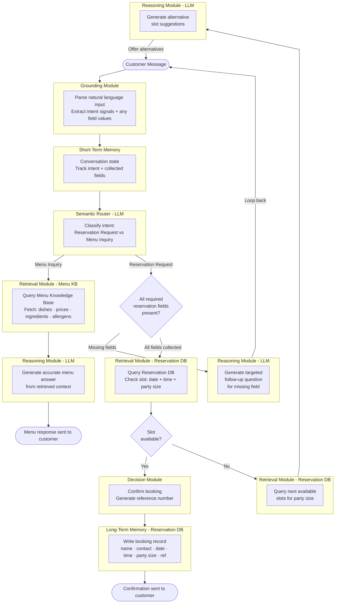

# The Pause Where I Go and Ask the Kitchen


Last time on Obi the Explorer, I wrote about [the design of the simplest possible restaurant chatbot](https://plurobi.com/blog/2026/09/03/turns-out-ai-agents-arent-mostly-ai/). It had one job: to take a table booking. The surprising bit was that the LLM only did two of the seven jobs.

<!-- more -->

However, it was designed on the assumption that every incoming message was a booking request. The agent didn't need to work out what you wanted, because there was only one thing you could want. This week I'm going to spice it up a bit more.

My experience inspired this example. Once, I was mid-booking for a party on a call, and I'd got the date and party size. Then I got asked about allergens, and I had to take a few minutes to get the answer from the kitchen. That was when it occurred to me. What if I didn't have to do all this?

To be clear, I don't mean the job. Max and Caroline from 2 Broke Girls would have answered that allergen question with something funny and, frankly, inappropriate (not really, though), and the customer would have left none the wiser. I wanted the opposite: a system that answers honestly and politely, without me having to walk to the kitchen every time.

## The new requirement

In this new scenario, we're going to address this gap by making the chatbot able to answer questions about the menu. Dishes, prices, ingredients, allergens. In addition, it should handle incomplete reservation requests more gracefully by asking follow-up questions rather than giving up.

## What it replaces

For menu questions, the staff currently:

1. Recite menu options from memory, or reach for a printed menu.
2. Check with the kitchen for anything specific about ingredients or allergens.
3. Point the customer to the website for the full PDF, usually by scanning a QR code.

For incomplete bookings:

1. Work out what information is missing
2. Ask for it, specifically, until everything is there
3. Only then check availability

Same exercise as last time. Checking with the kitchen is a **retrieval** action against a source the host doesn't hold in their head. Pointing to the website is an admission that the knowledge base lives elsewhere entirely. And the whole incomplete-booking flow is a loop with a condition.

## The problem in one line

The agent now has to handle two completely different intents from the same entry point.

| Intent | What it looks like |
|---|---|
| Make a reservation | "I'd like a table for 4 on Saturday" |
| Ask about the menu | "Do you have any gluten-free options?" |

Both intents are text and come from the same customer, often in the same conversation. But they need different data, different logic, and different responses. So, before the agent does anything, it has to recognise what the customer actually wants.

## Enter the Semantic Router

A **Semantic Router** is a classifier that sits near the front of the architecture and decides which path a message goes down. It doesn't answer or fetch anything. It reads the message and picks the correct path to resolve the query. This is one of the more common aspects of agentic systems.

Here's what changed from iteration 1:

| Component | Change |
|---|---|
| Grounding | Same: parse and normalise the input |
| Short-term memory | Same: track conversation state |
| Semantic Router | New: classify intent before any action |
| Retrieval — Reservation DB | Carried over |
| Retrieval — Menu KB | New: dishes, prices, allergens |
| Reasoning (LLM) | Now serves two paths, not one |
| Decision module | Same |
| Long-term memory | Same |

Two new components to account for. Everything else from the first iteration survives untouched, which is a good sign. If adding a feature had forced me to rewrite the booking flow, the first design would have been wrong.

## The two paths

```
Path A — Reservation:
  Router → collect fields → check availability → confirm

Path B — Menu inquiry:
  Router → retrieve from Menu KB → generate answer → respond
```

Notice that path A already contains the second requirement. The loop that asks for a missing phone number was built in iteration 1; fork 1 does exactly that. Nothing new was needed for it. What changed is that it now sits explicitly within a labelled path, so it's clear that the follow-up questions belong to the reservation flow rather than to the agent in general. Ask a menu question with half a booking still in memory, and you get an answer about the food, not a demand for your surname or any missed info.



## Three decisions worth arguing about

### Why does the router sit after short-term memory, not before it

You might feel it would be better to classify the message first, then load whatever context that path needs. I thought otherwise. Imagine a customer says "I want to book a table for Saturday." Then they ask their next question: "Does it have nuts?"

Alone, the second message is meaningless. There's no dish in it. "It" is doing all the work, and "it" is only defined earlier in the conversation. I keep having to remind myself that intelligence and context are not the same thing. The model can be perfectly capable of answering the question, yet have no idea what it refers to. People are no different. Walk into a conversation halfway through, and you can't contribute either, however clever you are.

This led me to conclude that the router needs the history to classify. **Memory informs routing.** Put the router first, and you've built something that handles every message as if it's the first one, which is the shortcoming I examined last week.

### One database, separate stores

It would be simpler to keep everything in one place, and you can. **pgvector** is an open-source extension for PostgreSQL that lets you store, index and query vector embeddings directly inside your relational database. One connection, one place to look, less to maintain.

But look at the two questions being asked of it:

- "Is a table for 4 free at 8 pm on Saturday?" This is an SQL query.
- "Do you have anything gluten-free that isn't too heavy?" This doesn't map to SQL at all.

That second one needs **semantic search**, where you compare the question's meaning against the dish descriptions' meanings. For the uninitiated, that's the retrieval half of Retrieval Augmented Generation (RAG). Text is converted into numbers that capture meaning, and then the closest matches are found.

Different data, different query patterns, different tuning. So they're separate stores, not separate databases. The same Postgres instance, different tables, indexed and tuned independently. That's the distinction that matters. Merge them into one table, and every change to the menu search puts the booking flow at risk.

### The rails now branch

Last week, I said this was an **agent on rails**. It follows a fixed sequence with a fixed toolset and no open-ended planning. This is still true. The flow is fixed, even though the steps inside it aren't. The router and the reasoning modules are still LLM calls. However, think of the rails forming a junction that changes which path you follow based on certain conditions.

Personally, I find this a more useful way to think about the autonomy spectrum. It isn't "does the agent plan?" so much as "how many places can this thing go, and who decides?" The first iteration had one destination. This has two. The agent still can't invent a third.

## What's still missing

The agent can now route and answer questions about food. Also, it can handle a half-finished booking without failing, but it does not know who it is interacting with. Every conversation starts from nothing. A regular gets the same experience as a new customer. This is because there's no learning module, and long-term memory stores only bookings, not people.

Ladies and gentlemen, we've encountered the personalisation problem, a testy subject. I'll go off personal experience here. Sometimes, brands retain your information without providing context, making you feel awkward rather than special. In comparison, others make the happy birthday email hit perfectly. So, in my experience, it's been 50/50.

It's hard to do well and very easy to do in a way that's worse than not doing it at all. So is it better to be usefully anonymous than badly personal? I'm not sure where that line is. The next requirement is [The One Where The Agent Learns](https://plurobi.com/blog/2026/09/21/the-one-where-the-agent-learns/).

If you're building agents and trying to figure it out, I'd genuinely like to hear about it.

--8<-- "cta-book-call.md"
