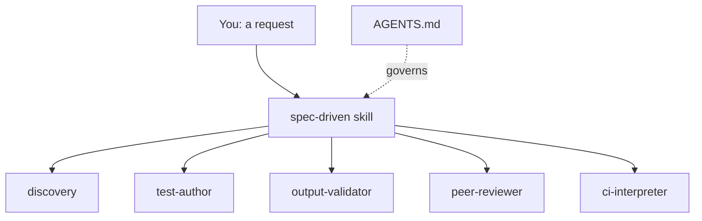

# Rules, Workflow, Sub-Agents: The Three Layers We Split Our AI Agent Into

**One file can't hold a rulebook, a process, and the actual grunt work without losing the thread on all three.**

That's what our first version of this system did. It doesn't anymore.

<!-- more -->

> **Previously, on Obi the Explorer**, we discussed how AI agents would write dbt models that compiled, passed every test, and were still wrong. So we stopped trusting their memory and turned the process into seven hard gates baked into the repo itself. Eleven weeks in, those gates have caught real defects that testing alone never would have. You can read the full post [here](https://plurobi.com/blog/2026/08/16/the-seven-gates-we-put-between-an-ai-agent-and-our-dbt-models/).
>
> Today, we open the hood to understand the rules, workflow, sub-agents, hooks, and Jira wiring that make those gates actually hold.
>
> **TL;DR:** We split the plugin into three layers: always-on rules, a user-triggered workflow, and isolated sub-agents for the heavy steps. Plus hooks to keep them synced across a session and MCP to reach outside the repo entirely. Each piece owns its job exactly once.

## Five terms, defined

Let's begin by getting the terminology out of the way before we get to the fun bits:

- **Agent** — an AI that reads files, runs commands, and takes multi-step action on its own. Contrary to popular belief, they can do more than answer questions. Think Jim Halpert from *The Office*, when he's actually happy and has agency.
- **Rules file (`AGENTS.md`)** — the standing rules an agent loads automatically at the start of every session. An [open, cross-tool standard](https://agents.md/), not vendor-specific. It's the employee handbook that everyone's already expected to know.
- **Skill (workflow)** — instructions that an agent loads only when that specific kind of task comes up, like the recipe for a specific dish that's ordered. Sorry, if you're reading this, know I'm hungry right now.
- **Sub-agent** — an isolated copy of the agent, spun up to do one job in its own private context, then hand back a summary.
- **Hook** — a script that fires automatically at a fixed point, whether or not the agent cooperates. Took me a while to understand this, too, so imagine a sprinkler system. The moment there's a hint of a fire, it's on — no permission needed.
- **MCP (Model Context Protocol)** — Anthropic's open standard for how an agent talks to outside tools without custom code for each one. As they say, it's a USB-C port for AI applications. One connector that lets anything built to the standard plug in.

With the boring bit out of the way, here's how we actually use them.

## The problem with one file doing everything

The first version of the spec-driven workflow didn't have any of the five pieces above working together as they do now. It was one markdown file bolted to the repo root that held the rules, the process, and an attempt to walk the agent through each step in order. It had no sub-agents, no hooks and no hard gates, just a suggested sequence the agent was supposed to follow.

I was fine. I mean, it mostly worked up until a session ran long. The agent would be three steps into implementation when the rules at the top of the file would fall out of active context, and it would quietly start improvising. Discovery, specification, and implementation were all competing for the same context window, and the earliest instructions lost that fight first.

## What changed the plan

We use Snowflake, and at a team day with them, one of their senior solutions architects walked us through a similar pattern their teams were adopting. Let's just say they were considerably further along than we were. He'd already split rules, workflow, and execution, and was using session hooks to prevent context compaction from silently dropping instructions mid-task. It was... eye-opening to say the least.

We left that conversation with a ton of notes and one clear next step: stop treating "the agent's instructions" as one thing. It's actually three different things, each with a different lifetime and a different job.

## The three-layer split

Each layer owns its content exactly once:

- **Rules (always-on)** → `AGENTS.md`
- **Workflow (user-triggered)** → the `spec-driven` skill
- **Isolated steps (spawned)** → sub-agents

### Layer 1: Rules/`AGENTS.md`

Ours includes the mandatory blocking engineering rules plus a **Project Profile**, the team-specific config. We're talking about naming conventions, materialisations, base branch, CI system, and so on. A hook auto-loads at the start of every session, so the agent never has to remember to check it. This way, it's already in context before the first message arrives.

We'll go deeper on the Project Profile itself in a later post in this series, but it's the reason other teams can adopt this without forking it. A little spoiler if you've made it this far.

### Layer 2: Workflow/the `spec-driven` skill

This is the process from Post 1, encoded as a skill the agent invokes on request from you, yes, you. Sorry, Joe Goldberg crept in for a sec there. We're back. It triggers when you go "fix bug X," "build feature Y," or explicitly via `/dbt-spec-driven:spec-driven` in cortex code or CoCo. It routes by intent (feature, bug, refactor, standalone review, standalone docs) and orchestrates the gated phases.

Critically, the skill never restates the rules. It points back at `AGENTS.md`. That single decision is most of what fixed our original context problem, because there are no more copies of the same rule drifting out of sync in two places.

### Layer 3: Sub-agents/five isolated workers

Five jobs are heavy enough, in context terms, that running them in the main thread would crowd out the actual work: `discovery`, `test-author`, `output-validator`, `peer-reviewer`, and `ci-interpreter`. Each spawns into its own isolated context, does one job, and hands back a structured report of what matters to the main agent.

The real shift was recognising that context is a scarce resource, not an infinite scratchpad. A clear less is more type of thing. Discovery alone can mean reading a dozen model files and tracing their lineage. If that lives in the main thread, by the time implementation starts, half the context budget is already spent on files nobody needs anymore.

**Pro tip:** Use a lightweight model like Haiku or Sonnet 5 (low) for discovery.

### The glue/hooks

`hooks/hooks.json` fires three of these automatically, no agent cooperation required. It loads `AGENTS.md` at session start, warns before context compaction (so nothing important gets silently dropped, the exact failure mode our first version had) and appends a session note on exit.

It ships as paired bash and PowerShell variants for every hook. Cortex runs whichever shell matches the OS; the non-matching variant fails silently. A mixed-OS team needs zero per-user configuration.

### One more connection: MCP

None of the above matters if "post the spec back to the ticket" actually means someone copy-pasting between a terminal and Jira by hand.

We connect two MCP servers to the workflow. The **Atlassian MCP** is essential: it's how the `discovery` sub-agent reads the ticket at the start of a session and how the Specify phase writes the numbered requirements back onto the same ticket. This way, the spec lives where the work lives instead of dying in a chat session.

The **Notion MCP** is secondary right now, but it is used when a piece of work is worth documenting somewhere more permanent than a PR description or in the repo — an end-to-end flow for that work. MCP is the wiring that lets any of those three (rules, workflow, and sub-agents) actually reach something outside the repo. For us now, it's a ticket today. But in the future, it could be a BI platform or a Teams channel.

## How it all connects

Three layers, one picture:

You ask, the skill routes, the workers run off to the side. Each one hands back a report rather than dumping its files into the main thread. Hooks and MCP wrap this picture, they don't sit inside it: they load the rules, warn before compaction, and reach Jira.

## What the split actually buys us

Since making the switch:

- The main thread stays focused on decisions, not on holding a dozen files' worth of discovery output
- Rules stop drifting, because there's exactly one copy of them
- Nothing gets lost to a mid-session compaction the agent didn't warn us about

## Where this goes next

The plugin is [open source under the MIT license](https://github.com/Simple-Online-Healthcare/dbt-spec-driven-plugin). If you're running an AI agent against your own dbt repo, I'd be curious what your version of "one file doing everything" looked like and whether it broke the same way ours did.

More posts in this series are landing on [plurobi.com](https://plurobi.com/) as the plugin's roadmap ships. Plus, more technical pits I'll be working on independently along the way.
