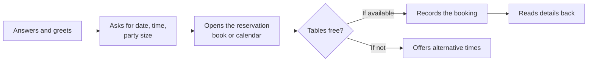
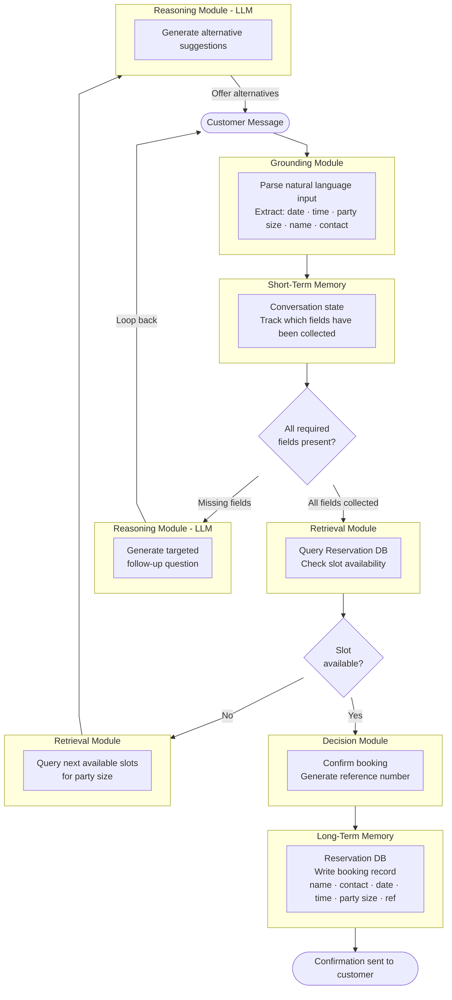

# Turns Out AI Agents Aren't Mostly AI


Recently, I've been playing around with cognitive architecture design. Don't worry, I'll dive into it in just a bit. But what I have found is that they make building AI agents easier because you have to actively invest in planning how data flows in and out, as well as the agent's decision-making, reasoning, grounding, and memory.

<!-- more -->

The best way I could understand this was to apply it to a real situation. In this case, a chatbot for a restaurant. You're probably wondering why a restaurant of all things. It's simple. I spent the better part of a year as a master's student working in hospitality. Too many experiences to recall, but I'll focus on the central points. It was hard!

Was the work rewarding? Yes. Did I learn valuable skills? Yes. Was a lot of it also repetitive? Definitely, so I thought, why not apply what I'm exploring to a use case I am very familiar with? Looking back, it gave me a newfound appreciation for Richie/Cousin from The Bear. Haha, you thought I was going to say service workers didn't you? Of course, them too.

In this post, I will explain what I understand about cognitive architecture, set the scene, and complete the first iteration, drawing on much of the theory I discuss.

## What a cognitive architecture actually is

You can think of a cognitive architecture as a blueprint. It describes the modules an AI agent has, and how information flows between them. This is what allows an agent to manage state, reason and act over multiple steps. That's it, really. It isn't a framework, and it isn't a product. It's what turns a single model call into a system.

The difference matters more than it sounds:

| Single LLM call | Cognitive architecture |
|---|---|
| Stateless | Stateful |
| Unpredictable | Debuggable |
| One-off | Maintainable and extensible |
| No memory between calls | Persistent memory across sessions |
| Cannot use tools | Integrates APIs, databases, calculators |

For every architecture, there are six components you can draw on. You could say these are its organs. They are:

- **Memory:** This stores short-term context and long-term facts. Think RAM + hard drive.
- **Grounding:** This is where you ingest and normalise the raw input. You're parsing your mail or reading this right now.
- **Retrieval:** The ability to fetch relevant knowledge from external stores. Like a librarian pulling the right books when you ask (completely unrelated, reading The Secret of Secrets by Dan Brown right now)
- **Reasoning:** Runs the LLM for planning, decomposition and decisions. This is the brain that thinks.
- **Learning:** Updates memory, prompts, and embeddings from feedback. Think about revising after failing a test.
- **Decision-making:** This orchestrates the full plan-act-observe-revise loop, just like a manager coordinating a team.

Notice that only one of those six is the model.

## The four questions

I asked the same four questions before every diagram in this series:

1. What is the client actually asking for?
2. What does the manual process reveal?
3. Which components does this need, and what does each one do here?
4. Which agentic pattern does this introduce?

Question two does most of the work, and that becomes more apparent as it's used.

## The situation

A restaurant owner wants a simple chatbot that takes table reservations. It should collect date, time, party size, name, and contact details. It should also check availability, confirm the booking, or tell the customer their slot isn't available.

Quite easily, you could prompt your way to a demo of this in an afternoon. But will it perform consistently?

## What it replaces

Here's what actually happens today, when a customer phones a restaurant. The host:

1. Answers and greets the customer
2. Asks for date, time, party size
3. Opens the reservation book or digital calendar
4. Checks whether tables are free for that time and party size
5. Records the booking with the name and phone number, if available
6. Offers alternative times (earlier, later or different days), if not
7. Provides verbal confirmation by reading the details back to confirm



If you take another look, you begin to see opportunities to apply some of the main components. For instance, step 3 is a **retrieval** action. Step 4 is a **decision** node. Step 6 is retrieval and reasoning because it fetches the free slots and then phrases them as a suggestion. This is why talking to customers is really the most important part. They're laying out the architecture in plain English without knowing it. The hard parts are being patient enough to translate it and, of course, building it.

## The architecture that falls out

| Component | Needed? | What it does here |
|---|---|---|
| Grounding | Yes | Parse the message, extract the fields |
| Short-term memory | Yes | Track which fields we've collected so far |
| Retrieval | Yes | Query the reservation DB for availability |
| Reasoning (LLM) | Yes | Decide what to say next |
| Decision logic | Yes | Two forks |
| Long-term memory | Yes | Write the confirmed booking |
| Learning | No | Nothing is being improved yet |

And the control flow is genuinely just two forks:

```
Fork 1: "Do I have all required fields?"
  → No  → Ask for what's missing (loop back)
  → Yes → Check availability

Fork 2: "Is the requested slot available?"
  → Yes → Confirm booking, write to DB
  → No  → Fetch alternatives, phrase them, loop back
```



## Three decisions worth arguing about

### Why two separate Reasoning boxes?

As seen in the diagram, the LLM gets used twice. Once to ask a follow-up question, once to phrase the alternative slots. I could have drawn one box instead of two, but I felt that the reasoning module shouldn't be a one-shot thing you place at the end. It's a **reusable capability** that is invoked at different points for different purposes. Collapsing it into one box hides that. However, I would like to point out that this is my interpretation. You are free to try a different approach.

### Why does the loop go back to "Customer Input"?

Because the agent is **stateful**, the next message triggers grounding again, but short-term memory already holds the fields collected last time. The agent picks up where it left off instead of starting over, which makes for the most user-friendly design.

### The refinement I had to make

My first version had one node doing "fetch available slots and craft the suggestion message." That's obviously two jobs, so I split it into a retrieval node followed by a reasoning node. This is the **single responsibility principle**, applied to architecture rather than code. For the uninitiated, basically, a function in code performs exactly one task. A box that does one thing can be swapped, tested and optimised on its own. A box that does two must be rewritten whenever either job changes. I carried that split through all six iterations, and it kept paying.

## Now count the boxes

From the diagram, it's clear that the LLM does only two of the jobs in the entire process. Grounding the input is really a parser. Short-term memory is a cache with a **Time To Live (TTL)**, the time it lasts before it expires. Retrieval is an SQL query. The decision forks are if-else statements, and Long-term memory is an insert into the database for storage.

Most of this system is not actually AI. It's setting up the data pipeline, control flow, and state management, which are, ironically, the same things that software engineers have been building for a while. Learning about building AI systems has shown me that vibe coding can get you a working product quickly, but the consistency in performance is a completely different situation.

I think this is why so many agents remain in demo hell. Most people don't have the patience or knowledge to learn the other bits outside of the AI implementation. Ironically, it turns out the harness is more important than people give it credit for because it ensures reliability. In the end, you need both. To be clear, it's hard to think through this, and this is the first iteration. But the time investment pays off.

This use case is also firmly an application of an **agent on rails** rather than an autonomous agent, which is a fixed sequence of steps with a fixed toolset and zero open-ended planning. Personally, I think of this as a spectrum instead of a binary choice.

## What's deliberately missing

There's no Learning module in this design. The agent executes perfectly and does not improve. Every conversation teaches it nothing. Currently, as-is, the agent is not equipped to learn a customer's preferences. So, a customer who books the same corner table every Saturday for a year is a stranger every day. That's fine for iteration one. This is the correct amount of system for the requirement in front of me. Building the memory layer before anyone asked for it would have been engineering for a problem I didn't have yet.

But it does leave a question I keep turning over: at what point does "we'll add that when we need it" become the reason the thing never gets good? The host at a real restaurant doesn't wait for a requirements document before he starts remembering people. He does it because it's obviously worth doing. I don't have a clean answer. Next requirement lands next week, and it's about the menu.

If you're building agents and trying to figure it out, I'd genuinely like to hear about it.

--8<-- "cta-book-call.md"
