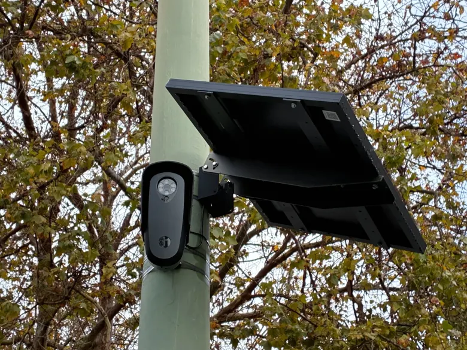

# Who's watching the Watchmen?

Flock Safety's cameras have helped solve over a million crimes. Its audit tool just caught nine cops abusing the system in one day. Both of those facts are true, and neither one settles the actual question: who decides how much surveillance is worth how much safety and who gets to check the checker?

<!-- more -->

## The story that gets told

No, I'm not talking about the DC limited series, unfortunately.

For 9 years, Flock Safety has been operating license plate cameras in 6,000+ US cities. In that time, they've helped solve over a million crimes and found 10,000+ missing people. In one instance, they helped locate and recover a stolen car with a 2-year-old in the back seat in an hour. A few months ago, the company shipped a tool that flags officers who run the same plate every day without a case number attached. According to their data, it's a pattern that closely resembles stalking. One Georgia department fired nine officers in a single day because of it. That's the version of the story that's easy to tell, and easy to like. It's also incomplete.

## The version underneath it

The company that sells the surveillance tool is also the one auditing it. There's no independent third party checking Flock's audit results. Garrett Langley, the CEO, describes third-party auditing as something "on the whiteboard," in the All-in podcast, not something that exists yet. The customer decides whether to review the flagged searches. The vendor decides what counts as a suspicious pattern in the first place. That's not necessarily wrong, but it's worth noting that the company grading its own homework is currently the only entity doing so.

The audit tool catches one specific shape of misuse. The example given in the episode is that the same plate, searched daily, with no case attached, is one signature. It's a real one, and it worked. But it says nothing about abuse that doesn't look like that. For instance, a single well-timed search or a favour called in once could spread a pattern over weeks rather than days. This, in particular, reminds me of Vin Makazian from The Sopranos. Despite Vin's struggles with his mental health, his desire to find a friend in Tony, and his incompetence as a gambler, he was really good at running plates. Catching the obvious pattern is real progress. It is not the same as solving the underlying problem, catching people like Vin.

Retention limits are set with little consistency and with barely any oversight. New Hampshire caps license plate data at 3 minutes. Washington allows 21 days. Most places run on whatever the vendor's default is because, as Langley himself says, most city councils don't have the expertise to independently evaluate the technology their police chief is asking them to approve. The "strong defaults" framing sounds responsible. It also means a private company is setting the starting point for a policy question that, in almost every other domain, would sit with elected regulators.

> "This data is a liability, not an asset."

That's a fair way to describe license-plate data. It's also strange for a company to talk about the product it sells like that while continuing to expand the number of cities running it.

## The part that doesn't resolve cleanly

The most uncomfortable detail in the source interview isn't about the technology at all. It's a story about an Illinois elected official who is one of Flock's loudest critics, reversing her position after being the target of political violence, when a Flock camera helped identify the person who shot at her house. It shows how quickly a privacy conviction can move once a person becomes the one in need of safety. A policy shaped by whoever was most recently harmed is not the same as a policy shaped by principle.

Another thing that stood out to me in the interview was that people who already have private security, a gated community, and a driver tend to be the loudest voices against expanding public surveillance tools because they've already bought their way out of needing them. The people with the least ability to opt out of a surveillance system are often the same people with the fewest alternatives if it gets turned off. Neither side of that gets to claim the moral high ground. That's the actual tension. It really isn't about whether cameras are good or bad; the bigger question is who bears the cost of getting the trade-off wrong, and who gets to make that call on their behalf.

## The question is worth asking

I'm not arguing whether Flock as a company or its new audit tool is bad. You can't argue with catching nine corrupt officers in a day. In Nigeria, where I'm from, we had national protests to end police brutality. Granted, it's a different type of corruption, but Flock's cameras would've helped expose what SARS was doing long before everything erupted, except at the Lekki toll gate. Those cameras wouldn't have been on anyway. If you know, you know.

However, treating a vendor-built, vendor-graded audit system as the endpoint of oversight, rather than a first step, undersells how unfinished this actually is.

Worth asking of any system, surveillance, AI, or otherwise, where one party holds both the access and the audit trail: what happens when the vendor's incentive to look good and the public's need for real accountability start to pull in different directions?

Flock hasn't answered that yet. Neither, really, has anyone else in this space.

--8<-- "cta-book-call.md"
