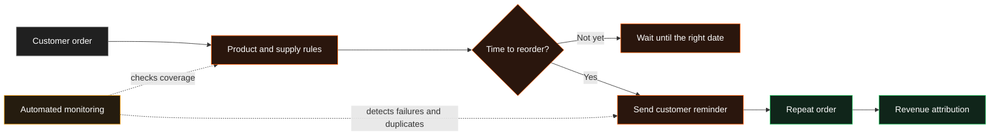

# Automated Repeat Revenue Engine

!!! abstract "Case Study Summary"
    **Client context:** Anonymised multi-market subscription business  
    **Delivery type:** Production revenue automation and reliability  
    **My role:** Analytics / Data Engineer  
    **Headline impact:** More than **£5M in attributed repeat revenue** during seven months of active co-ownership

An automated reminder is only valuable when it reaches the right customer, for the right product, at the right time.

I co-owned the data system behind a large repeat-order programme. My work focused on making it safer, easier to extend, and much harder to fail silently.

## Challenge

The business used automated reminders to bring customers back when they were due to reorder. The programme was commercially important, but the data pipeline behind it had several points of risk:

- New product variants depended on manually maintained configuration.
- A missing configuration row could silently stop a customer from receiving a reminder.
- A changing timestamp could make the same reminder look like a new event and trigger it twice.
- Products sharing a generic size label could inherit the wrong reminder timing.
- Delivery failures could remain hidden because the wider data job had no dedicated end-to-end monitoring for this journey.

These were not abstract data-quality issues. They could lead to lost repeat orders, duplicate messages, poor customer experience, and reduced trust in a revenue-critical programme.

## Technical Solution

I strengthened the system at four levels.

### 1. Automated product coverage

I replaced a spreadsheet-only dependency with a hybrid model. Standard reminder timing is derived from product and order metadata, while manually maintained values remain available as controlled overrides for genuine exceptions.

This means new standard product variants can enter the reminder journey automatically instead of relying on someone remembering an additional configuration task.

### 2. Stable and accurate customer events

I redesigned event identifiers so the same logical reminder keeps the same identity even when an upstream timestamp changes. I also corrected the product lookup to use the true product-and-size combination rather than a shared size label.

That prevented duplicate reminders and stopped reminder rules leaking onto unrelated products.

### 3. End-to-end monitoring

I built the programme's dedicated monitoring safety net. The checks detect problems such as:

- reminders no longer being generated;
- event volumes changing abnormally;
- delivery data becoming stale;
- products missing timing information; and
- product quantities or reminder dates no longer following the agreed rules.

### 4. Extension to a new product line

I connected a newly launched product to the same automated reorder journey, so it could benefit from the existing repeat-revenue engine without creating a separate manual process.

## Results & Impact

- Supported **£5M+ in attributed repeat revenue** during the seven months I actively maintained the system — approximately **£700k per month**.
- Helped safeguard a wider reminder programme associated with **£14M+ in attributed revenue** over its lifetime.
- Restored automatic reminder coverage for approximately **870 customers across 2,400 orders** when new product variants had been missed by the manual configuration process.
- Corrected a duplicate-send issue where daily reminder volumes for two major product groups had almost doubled.
- Reduced reminders sent to unrelated accessories to **zero** while preserving more than **160,000 legitimate reminders** in validation.
- Added dedicated monitoring so a failure in a commercially important journey could be detected instead of remaining silent.

!!! note "How the figures are framed"
    Revenue is last-click attributed to the reminder programme. I did not create the original programme alone: I co-owned its data logic, built its monitoring layer, extended it, and shipped the fixes described above.

## Solution Architecture

The diagram deliberately shows only the components needed to understand the business flow.

## Tech Stack

- Snowflake
- dbt
- SQL and Jinja
- Reverse ETL
- Customer messaging automation
- Automated data-quality and freshness tests
- GitHub pull-request workflow

## Additional Context

- **Period:** December 2025 to July 2026
- **Environment:** Production, multi-market customer lifecycle system
- **My contribution:** Pipeline co-ownership, product-coverage automation, event-identity redesign, monitoring, incident fixes, validation, and documentation
- **Confidentiality:** Client and product names have been removed; commercial figures are rounded

--8<-- "cta-book-call.md"
