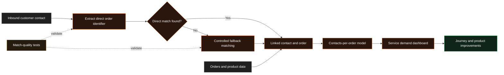

# Customer Contact Intelligence

!!! abstract "Case Study Summary"
    **Client context:** Anonymised high-volume customer operations business  
    **Delivery type:** Production service analytics and data matching  
    **My role:** Analytics / Data Engineer  
    **Headline impact:** More than **5,000 inbound contacts** reconnected to the orders they concerned

The business wanted to understand which orders generated the most customer contact. The problem was that most inbound messages were not reliably linked to an order, so the reporting could not answer the question.

## Challenge

A broken identifier path meant order IDs were missing for the overwhelming majority of inbound tickets. As a result:

- customer contact appeared disconnected from the transaction that caused it;
- contact-per-order reporting understated service demand;
- teams could not reliably identify products or journeys creating avoidable support work;
- duplicated transformation logic made the model difficult to maintain; and
- any decisions based on the existing linkage risked being misleading.

## Technical Solution

I rebuilt the matching process around multiple sources of evidence rather than relying on one fragile identifier.

### 1. Fixed the primary order link

I corrected the logic that extracted and propagated the order identifier from the source data, restoring the intended direct match for inbound contacts.

### 2. Added a controlled fallback

Where the direct identifier was unavailable, I added a secondary matching route using other transaction and customer clues. The fallback was designed to increase coverage without pretending every possible match was certain.

### 3. Created a reusable matching layer

I moved repeated logic into a shared macro and reduced a large block of duplicated SQL to a much smaller, governed implementation.

### 4. Built contact-per-order reporting

The final model connected contacts, orders, products, and channels so teams could compare service demand across different customer journeys.

## Results & Impact

- Increased linked inbound tickets in one validation set from **40 to more than 5,300**.
- Added more than **5,400 additional candidate links** through the fallback route over the measured period.
- Reduced repeated transformation logic from roughly **240 lines to 80**.
- Passed **84 automated tests** across the refactored models.
- Created a practical lower-bound view of which orders and products generated the most customer contact.

!!! note "Coverage and interpretation"
    Not every contact can be linked with certainty. The reporting is framed as a reliable lower bound, with direct matches preferred and fallback matches handled transparently.

## Solution Architecture

## Tech Stack

- Snowflake
- dbt
- SQL and Jinja macros
- Customer-support platform data
- Order and product data
- Looker / LookML
- Automated data tests

## Additional Context

- **Period:** 2026
- **Environment:** Production customer-service and order analytics
- **My contribution:** Root-cause analysis, identifier repair, fallback design, macro refactor, reporting models, validation, and documentation
- **Confidentiality:** Client, platform, and product names have been removed; figures are rounded

--8<-- "cta-book-call.md"