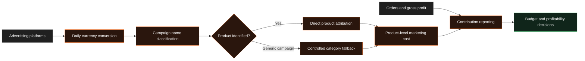

# Marketing Attribution Engine

!!! abstract "Case Study Summary"
    **Client context:** Anonymised multi-market digital business  
    **Delivery type:** Production marketing and profitability analytics  
    **My role:** Analytics / Data Engineer  
    **Headline impact:** **£50M+ in advertising spend** made directly attributable at product level

Marketing data is only useful when a business can connect each pound of spend to the product and market it was intended to grow.

I rebuilt an attribution layer that had relied on a rough proportional estimate, replacing it with campaign-level product matching and consistent currency conversion.

## Challenge

The business advertised several products across multiple platforms, brands, and currencies. Its reporting could show total spend, but the allocation of that spend to individual products was based on each product's share of gross profit.

That approach was directionally useful, but it worked backwards: gross profit is an outcome of sales, not evidence of what a campaign was promoting.

The model also faced several practical complications:

- Campaign names used different product terms and abbreviations.
- Spend arrived in GBP, EUR, AUD, and USD.
- Some markets could advertise a specific product by name, while others had to use generic category language.
- A large date spine generated rows with no spend and added unnecessary processing.
- Product profitability could be overstated when valid marketing costs failed to match an order group.

The result was avoidable uncertainty in product-level acquisition cost and contribution reporting.

## Technical Solution

I redesigned the model around the evidence available in each campaign.

### 1. Normalised every currency

I added daily exchange-rate matching so spend from every market enters reporting in GBP. The model uses the rate that was valid on the campaign date rather than a fixed or current-day conversion.

### 2. Identified the product being promoted

I created a reusable campaign-classification rule that reads campaign names and maps related terms to governed product groups. The logic handles product names, active ingredients, alternative market terms, and category-level campaigns.

### 3. Changed the reporting grain

I rebuilt marketing costs from a broad date, brand, and category grain to a date, brand, category, and product grain. This allowed spend to join directly to the product it was designed to sell.

### 4. Designed a controlled fallback

A direct match was not possible in markets where campaigns were legally or operationally required to use generic language. Instead of dropping that spend, I added a transparent fallback that allocates only the unmatched category spend across eligible products.

Direct evidence remains the preferred route; estimation is used only where the source data cannot identify a product.

### 5. Connected attribution to profitability

The product-level marketing costs feed the contribution model used to compare revenue, gross profit, marketing cost, and final contribution by product and market.

## Results & Impact

- Made more than **£50M in historical advertising spend** directly attributable to product performance where campaign evidence was available.
- Normalised multi-market spend into a single reporting currency, improving comparisons across regions.
- Replaced a broad proportional estimate with campaign-level matching for product-specific advertising.
- Reduced the marketing-cost dataset by approximately **39%** by removing unused zero-spend rows.
- Corrected an approximately **£10k contribution overstatement** in one market where generic campaign spend had previously failed to match the products sold.
- Improved the reliability of product-level acquisition cost and profitability — the figures used to decide where the next marketing pound should go.

!!! note "How the figures are framed"
    This project improved the accuracy and usefulness of decisions made across £50M+ of spend. It should not be read as £50M of savings or revenue generated personally.

## Solution Architecture

## Tech Stack

- Snowflake
- dbt
- SQL and Jinja macros
- Google Ads and Meta advertising data
- Daily foreign-exchange data
- Product-level contribution modelling
- Automated data-quality checks
- Executive and commercial reporting

## Additional Context

- **Period:** January to June 2026
- **Environment:** Production, multi-market acquisition and profitability reporting
- **My contribution:** Currency-conversion logic, campaign classification, model-grain redesign, fallback allocation, contribution integration, validation, and documentation
- **Confidentiality:** Client and product names have been removed; figures are rounded

--8<-- "cta-book-call.md"
