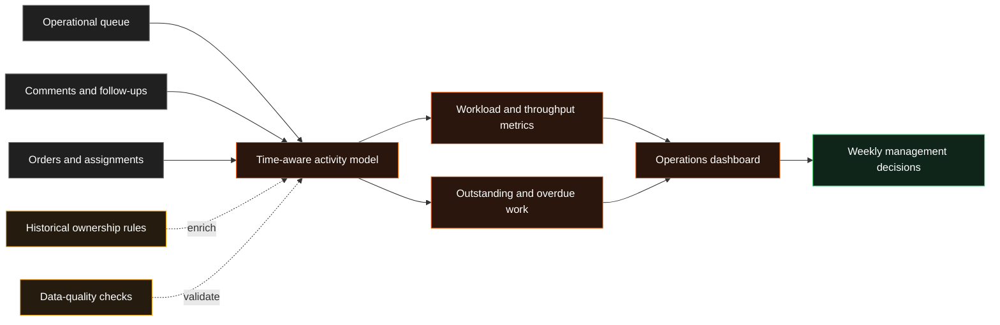

# Operations Control Tower

!!! abstract "Case Study Summary"
    **Client context:** Anonymised regulated operations business  
    **Delivery type:** Production operational analytics  
    **My role:** Analytics / Data Engineer  
    **Headline impact:** **5,000+ weekly operational actions** made visible

A team cannot improve work it cannot see. I rebuilt an operational reporting system so managers could understand the true volume of work completed, what remained outstanding, and how activity changed over time.

## Challenge

The original reporting relied heavily on the current state of an operational queue. That was useful for seeing what was open now, but weak for understanding what had happened historically.

When an item left the queue, much of its earlier activity disappeared from the management view. This created several problems:

- completed work was undercounted;
- historical workload appeared much smaller than it really was;
- managers could not reliably compare teams or time periods;
- overdue work and repeated follow-ups were difficult to analyse; and
- operational decisions were being made from a partial picture.

## Technical Solution

I built a time-aware reporting layer that preserved both the current queue and the history behind it.

### 1. Reconstructed historical activity

I combined comments, order activity, assignments, and queue changes into a governed operational history rather than treating the latest queue snapshot as the complete record.

### 2. Added time-aware ownership

I introduced historical ownership logic so work was attributed to the team or agent responsible at the time, rather than whoever happened to own it when the report was viewed.

### 3. Modelled workload and outcomes

The reporting layer separated new work, follow-ups, completed actions, outstanding work, and overdue work. This gave leaders a clearer view of demand, throughput, and operational pressure.

### 4. Created management-ready reporting

I exposed the model through reporting views designed for weekly operational reviews, allowing managers to move from anecdotal updates to evidence-based discussions.

## Results & Impact

- Made **5,000+ weekly operational actions** visible in recurring management reporting.
- Expanded one historical validation period from roughly **80 to 770 recorded actions**.
- Increased represented orders from approximately **45 to 483** in the same comparison.
- Improved visibility of real workload, throughput, overdue work, and repeated follow-ups.
- Created a reusable foundation for operational dashboards and weekly performance reviews.

!!! note "How the figures are framed"
    The project improved visibility and management accuracy. The numbers represent operational activity surfaced by the reporting system, not additional work created by the model.

## Solution Architecture

## Tech Stack

- Snowflake
- dbt
- SQL
- Looker / LookML
- Historical and slowly changing data models
- Automated data-quality tests
- Operational dashboards

## Additional Context

- **Period:** 2026
- **Environment:** Production operational and management reporting
- **My contribution:** Historical model design, time-aware ownership, metric definition, reporting views, validation, and documentation
- **Confidentiality:** Client, team, and workflow names have been removed; figures are rounded

--8<-- "cta-book-call.md"