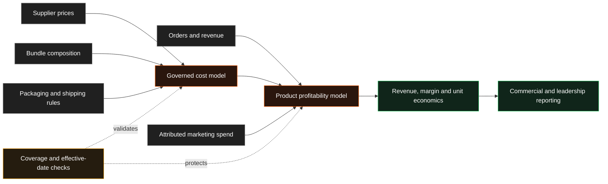

# Product Launch Profitability System

!!! abstract "Case Study Summary"
    **Client context:** Anonymised consumer product launch  
    **Delivery type:** Production commercial analytics  
    **My role:** Analytics / Data Engineer  
    **Headline impact:** **14k+ orders** made measurable with **99.97% cost coverage**

A new product can generate sales from day one while still leaving leaders unable to answer the most important question: **is it actually profitable?**

I built the data path that connected the product's real costs to its orders, turning a blind spot into a reliable view of revenue, gross profit, margin, and unit economics.

## Challenge

The business launched a new product line with several strengths and prepaid starter bundles. Orders and revenue were visible, but the cost of the product was not flowing through the reporting system.

Without a recognised cost, the profitability model fell back to a broad category estimate. That created several risks:

- Leaders could see sales but not trustworthy product margin.
- Bundles appeared without a complete combined cost.
- Placeholder supplier prices could materially overstate profitability.
- Incorrect effective dates could apply launch costs to pre-launch test orders.
- Packaging and shipping differences between products were being averaged rather than measured individually.

The launch therefore had a commercial measurement problem, not simply a missing column.

## Technical Solution

I built a version-controlled profitability path from source costs to executive reporting.

### 1. Connected real product costs

I added the product's supplier prices to governed reference data and created a temporary mapping route for products that had launched before permanent external reference codes were available.

This allowed cost data to flow through the existing cost-of-goods pipeline without waiting for a separate external-data dependency.

### 2. Modelled bundle economics

The product was sold through starter bundles containing several component items. I defined the bundle composition and calculated the combined cost of each journey so bundled orders could be measured correctly.

### 3. Added product-level operating costs

I extended the profitability model to include item-level packaging and shipping assumptions. This captured the real difference between ambient and cold-chain fulfilment rather than spreading one average cost across every product.

### 4. Added effective-date controls and validation

Costs were tied to the dates on which they became valid. I corrected a date error that had applied launch costs to pre-launch activity and added checks around key mappings and cost coverage.

### 5. Connected the launch to downstream reporting

The final model combined order revenue, product cost, bundle cost, packaging, shipping, and attributed marketing spend so leaders could evaluate the product on its own economics.

## Results & Impact

- Made approximately **14,300 orders and £1.4M in sales** commercially measurable.
- Increased recognised product-cost coverage from **0% to 99.97%**.
- Made approximately **£425k in gross profit** and a margin of around **30%** visible for the first time.
- Corrected estimated margins that had appeared to be approximately **48–49%**, replacing them with product-level margins of roughly **31–42%**, depending on the variant.
- Added complete costs for two starter bundles, including combined costs of approximately **£148** and **£242**.
- Captured an operating-cost change worth approximately **£1.10 per applicable order**.
- Fixed an effective-date error that had produced a reported **£74 loss on an order worth only a few pounds**.

!!! note "How the figures are framed"
    The sales were generated by the product and the wider business. My contribution was making the costs, margins, and unit economics trustworthy enough to manage the launch commercially.

## Solution Architecture

## Tech Stack

- Snowflake
- dbt
- SQL
- Version-controlled reference data
- Effective-dated cost modelling
- Bundle and product-grain transformations
- Automated coverage and integrity tests
- Executive profitability reporting

## Additional Context

- **Period:** June to July 2026
- **Environment:** Production product-launch and executive reporting systems
- **My contribution:** Cost-path design, supplier-price updates, bundle modelling, packaging logic, effective-date fixes, validation, and documentation
- **Confidentiality:** Client and product names have been removed; figures are rounded

--8<-- "cta-book-call.md"
