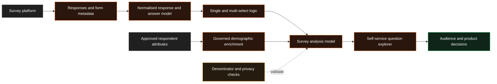

# Survey Intelligence Platform

!!! abstract "Case Study Summary"
    **Client context:** Anonymised regulated consumer business  
    **Delivery type:** Production self-service analytics  
    **My role:** Analytics / Data Engineer  
    **Headline impact:** Reusable analysis across **five demographic breakdowns** without rebuilding spreadsheets for every question

Survey data is easy to collect and surprisingly difficult to analyse well. I built a reusable data model that turned raw responses into consistent, self-service reporting for both single-select and multi-select questions.

## Challenge

Survey exports were structured for collection rather than analysis. Questions, answers, selected options, respondent attributes, and repeated form versions were spread across nested fields and duplicated transformation logic.

This made simple questions unnecessarily expensive to answer:

- every new analysis required manual spreadsheet preparation;
- multi-select answers could not be counted consistently;
- percentages could use the wrong denominator;
- comparing responses by demographic group required repeated custom work; and
- sensitive fields needed clear governance before being exposed in reporting.

## Technical Solution

I created a reusable survey data layer that separated collection structure from analytical structure.

### 1. Normalised responses and answers

I modelled the data at response, question, and selected-option level so each answer could be counted correctly, including questions where one respondent selected several options.

### 2. Standardised question metadata

I created governed mappings for question text, field types, form versions, and answer choices, reducing duplicated logic and making new forms easier to onboard.

### 3. Added reliable denominators

I introduced denominator fields for respondent-level and question-level percentages so analysts could distinguish between share of respondents, share of answers, and share within a subgroup.

### 4. Enriched analysis safely

I connected approved respondent attributes and made sensitive or health-related fields explicit, supporting controlled comparisons by age, generation, gender, BMI, and country.

### 5. Built self-service reporting

The final reporting layer allowed teams to choose a question and compare responses across demographic groups without recreating pivots, formulas, or bespoke extracts.

## Results & Impact

- Enabled reusable survey analysis across **five demographic breakdowns**.
- Supported single-select and multi-select questions in one consistent model.
- Removed roughly **160 lines of duplicated transformation logic** during the refactor.
- Replaced repeated spreadsheet preparation with a governed, self-service reporting workflow.
- Added clear denominator logic, reducing the risk of misleading percentages.
- Improved governance by explicitly identifying sensitive and health-related survey fields.

!!! note "How the impact is framed"
    This project removed repeated analytical preparation and made survey exploration self-service. No unsupported hours-saved estimate is claimed because the previous manual effort was not formally timed.

## Solution Architecture

## Tech Stack

- Snowflake
- dbt
- SQL
- Survey-platform API data
- Looker / LookML
- Reusable question and answer models
- Data-governance flags
- Automated data-quality tests

## Additional Context

- **Period:** 2026
- **Environment:** Production research and customer-insight reporting
- **My contribution:** Source modelling, multi-select design, denominator logic, demographic enrichment, governance flags, reporting views, validation, and documentation
- **Confidentiality:** Client, survey, and question details have been removed

--8<-- "cta-book-call.md"